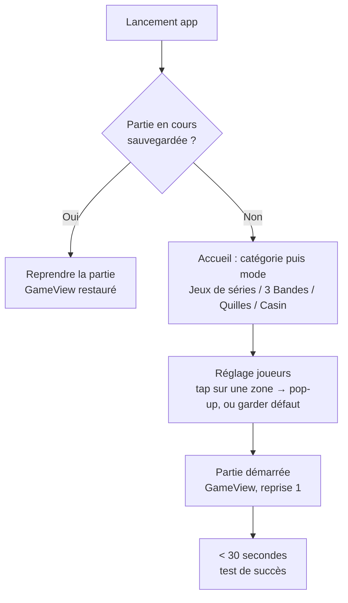
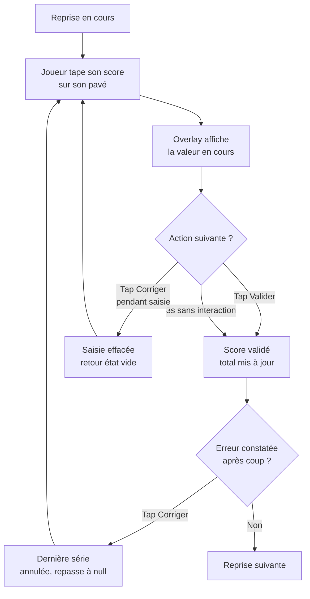
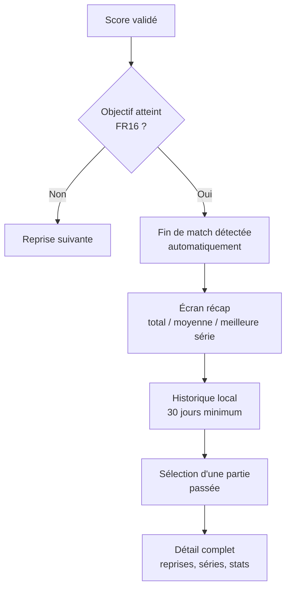

# UX Design Specification Carom Scoreboard

**Author:** Nathan
**Date:** 2026-09-07

---

<!-- UX design content will be appended sequentially through collaborative workflow steps -->

## Executive Summary

### Project Vision

Scoreboard tablette pour billard carambole français — PWA offline-first, expérience "MVP délectable" avant tout, avec une trajectoire V1→V4 vers l'infrastructure de données de la fédération française.

### Target Users

- **Michel** (63 ans, joueur de club) — zéro formation, doit démarrer une partie seul en moins de 30 secondes
- **Didier** (responsable de club, peu tech) — reçoit et installe le matériel sans accompagnement technique
- V2/V3 (hors scope de cette session UX V1) : arbitres, organisateurs de tournoi, streameurs

### Key Design Challenges

- **Correction anxiety-free** : le risque UX #1 identifié par Nathan est la peur de l'erreur sans recours — un joueur senior qui se trompe de saisie doit immédiatement voir comment corriger, sans crainte de "casser" la partie. Le bouton d'annulation/correction doit être aussi visible et rassurant que le pavé de saisie lui-même, jamais traité comme une action "avancée" ou cachée.
- **Distance de lecture vs esthétique saturée** : conserver la lisibilité à 2m (score) et 5m (vue salle V2+) tout en adoptant des couleurs vives pleine-surface façon coréenne, sans sacrifier le contraste WCAG AA (NFR10).
- **Identité par la bille, fixée au côté** *(révisé le 2026-09-08 — l'observation initiale « couleur assignée au joueur, pas à la position » était une erreur de lecture des références)* : gauche = blanche, droite = jaune, comme sur CUESCO et Billiboard ; le tour actif se signale par un liseré autour du panneau du joueur qui doit jouer, jamais par la teinte du bloc.
- **Décision de design system différée** : Nathan formalisera la palette/typo définitive plus tard à partir des captures d'écran coréennes (`explore/resources/`) ; en attendant, on travaille par patterns extraits de ces références (hiérarchie, couleur, feedback) plutôt que par tokens figés.

### Design Opportunities

- **Écran de fin de partie comme moment fort** : le format "battle" observé sur les systèmes coréens (bandeau VS, médaille winner/loser, stats comparées côte à côte) transforme le récapitulatif en moment gratifiant — aligné avec l'idée #23 du brainstorming (moments clés amplifiés).
- **Pattern couleur + bordure active** déjà validé sur le terrain coréen (CUESCO, Billiboard, VIEW LIFE) — réutilisable tel quel pour signaler visuellement qui doit jouer.
- **Différenciation vs. concurrence française** : aucun produit équivalent n'existe sur ce marché ; le ton "digital/esport" positionne d'emblée le produit comme premium/moderne face à la feuille papier.

**Direction visuelle retenue :** digital / esport coréen — couleurs saturées en blocs pleins, ambiance compétitive et gratifiante, écrans de résultat type "battle". Référence directe : les 20 captures d'écran de systèmes coréens dans `explore/resources/`.

## Core User Experience

### Defining Experience

Il n'y a pas une action cœur unique, mais **deux patterns de saisie distincts selon le mode de jeu**, que le `PlayerPanel` doit supporter sans changer de composant :

**1. Modes JDS (Libre, Cadre 47/2, 47/1, 71/2, 1 Bande, 4 Billes) — saisie différée au pavé numérique.** Peu d'alternances par reprise, scores élevés (10–100+). Le joueur saisit le score final de sa série au pavé après son tour.

**2. Mode 3 Bandes — incrémentation tactile en temps réel.** Scores rares et unitaires (séries souvent < 10 points). Ce n'est pas le joueur qui tire qui saisit : c'est **le joueur assis (non-actif)** qui tape sur sa propre zone pour ajouter un point à l'adversaire en train de jouer. Ce tap a un double rôle : marqueur de synchronisation caméra (coupe le rush vidéo au moment du point — fondation pour l'indexation vidéo V4) et reset du chrono de tir (40s), utile aussi en entraînement solo. Le pavé numérique reste disponible en backup pour saisir directement une série complète si l'adversaire oublie de taper au fil de l'eau.

### Platform Strategy

PWA tactile installée sur tablette, 100% offline en V1, cibles Android 10+ et iPadOS 15+, Pointer Events (pas de délai tactile 300ms), layout 3 colonnes paysage (décisions déjà actées en architecture).

### Effortless Interactions

Le calcul du score total, de la moyenne et de la meilleure série doit être entièrement invisible pour l'utilisateur — zéro calcul mental, à aucun moment (FR3, FR17).

### Critical Success Moments

- **Premier lancement** : Michel démarre seul, sans lire de texte, en moins de 30 secondes — doit fonctionner dès le premier contact, sans marge d'erreur.
- **Correction sans stress** : un joueur qui se trompe doit voir immédiatement et sans ambiguïté comment revenir en arrière — le point de rupture n°1 identifié pour la confiance dans l'outil.
- **Fin de partie** : la révélation automatique des stats ("8,75 de moyenne, c'est mon record") doit être le moment le plus gratifiant de la session, inspiré des écrans "battle" coréens.

### Experience Principles

1. **Un seul geste par mode, jamais d'ambiguïté** — le pattern de saisie change selon le mode de jeu (différé vs temps réel), mais reste unique et prévisible à l'intérieur d'un mode donné.
2. **L'erreur est réversible et visible** — la correction a la même importance visuelle que la saisie, jamais reléguée à un menu.
3. **Le calcul est invisible pour l'utilisateur** — totaux, moyennes, records : le système calcule, jamais le joueur.
4. **La fin de partie récompense** — un moment de reconnaissance visuelle/émotionnelle, pas un simple tableau de chiffres.

## Desired Emotional Response

### Primary Emotional Goals

Confiance sereine sous surface excitante — le joueur doit se sentir immédiatement en contrôle et en sécurité (jamais anxieux face à la technologie), tandis que l'écran lui-même dégage l'énergie compétitive d'un vrai jeu (ton "digital/esport").

### Emotional Journey Mapping

- **Découverte** (premier lancement) : rassurant, pas intimidant — zéro jargon, zéro écran de configuration complexe.
- **Pendant la partie** : fluide et presque invisible — le joueur pense à son jeu, pas à l'outil.
- **En cas d'erreur** : calme, jamais punitif — la correction doit se sentir "normale", pas comme un échec.
- **Fin de partie** : pic d'excitation et de fierté — le ton "battle" coréen s'exprime pleinement (Michel qui annonce fièrement sa moyenne).
- **Retour à l'usage** (partie suivante, historique) : fierté de la progression — voir sa moyenne évoluer dans le temps.

### Micro-Emotions

- **Confiance > Scepticisme** — critique pour Didier (admin peu tech) qui doit faire confiance à l'outil dès le déballage.
- **Calme > Anxiété** — sur la correction, le point de rupture UX n°1 identifié précédemment.
- **Fierté > Indifférence** — sur les stats de fin de partie et l'évolution dans l'historique.

### Design Implications

- **Confiance** → onboarding sans configuration, pictogrammes explicites, aucun texte explicatif requis pour démarrer (NFR12).
- **Calme sur l'erreur** → bouton de correction toujours visible et de même poids visuel que la saisie, jamais dans un sous-menu.
- **Fierté en fin de partie** → écran de résultat façon "battle" coréen (score comparé, record mis en avant), pas un simple tableau statique.

### Emotional Design Principles

1. **Rassurer avant d'impressionner** — la confiance prime sur l'esthétique à chaque étape où l'utilisateur pourrait douter (démarrage, correction).
2. **L'excitation se gagne, elle ne s'impose pas** — le ton compétitif s'exprime pleinement aux moments de succès (fin de partie, record), pas en permanence pendant la saisie.
3. **Aucune émotion négative ne doit provenir de l'outil lui-même** — confusion, peur de casser la partie, ou sentiment d'être jugé/lent sont à éliminer systématiquement, en particulier pour le public senior.

## UX Pattern Analysis & Inspiration

### Inspiring Products Analysis

Trois systèmes coréens réels servent de référence, avec des rôles différents :

**CUESCO** — leader historique du marché coréen (scoreboard officiel de la fédération coréenne et de l'UMB, fédération mondiale — validation forte de la stratégie "cheval de troie fédéral" du PRD). Sa brochure commerciale révèle le pattern le plus précieux : **une seule coque UI (2 panneaux joueur + console centrale) décline 6 modes de jeu très différents** (3-bandes, snooker, survival/pari, partie simple, mode "alphanumérique" façon Casin, pool/poches) — seuls le widget central et les boutons d'action changent. Référence **visuelle et structurelle** principale : blocs pleins, chiffre de score géant, peu d'éléments simultanés.

**Billiboard** — même famille visuelle épurée que CUESCO, confirme le pattern de console centrale simple (inning, chrono, bouton d'action unique).

**Billizone** — référence **fonctionnelle uniquement**, pas visuelle (son interface est plus chargée, thème sombre dense, jugée trop chargée). En retenir seulement deux idées : afficher le score restant vers l'objectif en plus du score courant, et nommer explicitement un bouton d'annulation de tour plutôt que de cacher cette action.

### Transferable UX Patterns

- **Shell unique multi-modes** — 2 panneaux joueur + console centrale identiques quel que soit le mode de jeu ; seul le widget central et le bouton d'action rapide changent. Validé par 6 déclinaisons réelles chez CUESCO.
- **Chiffre de score géant, seul élément dominant** — confirmé sur l'ensemble des modes observés, pas une exception.
- **Saisie rapide simple** : un bouton **+1** unique (pas une rangée de boutons +2/+3/+5/+10) accompagné d'une affordance claire (icône pavé numérique) pour ouvrir la saisie complète quand la série vaut plus qu'un point. Le détail exact sera affiné en développement.
- **Score restant vers l'objectif** affiché à côté du score courant, dès qu'un format de match a un objectif (FR15).
- **Bouton d'annulation nommé et visible** dans la console centrale, jamais un geste implicite.
- **Fin de partie façon "battle"** — bandeau VS, médaille, tableau comparatif.

### Anti-Patterns to Avoid

- **Surcharge de la console centrale** (l'anti-pattern Billizone) — trop d'éléments simultanés, thème dense, nuit à la lisibilité pour un public senior novice.
- **Design daté façon "concurrents grisâtres"** — identifié par CUESCO lui-même dans sa propre brochure comparative : UI dense, contrastes gris/noirs, boutons ronds mal hiérarchisés.
- **Rangées de boutons rapides multiples** (+1/+2/+3/+5/+10) — écarté par Nathan au profit d'un unique bouton +1 plus une ouverture claire vers le pavé complet.
- **Textes/jargon non traduit ou peu clair** — confirme NFR12.

### Design Inspiration Strategy

**À adopter :** shell unique multi-modes en 3 blocs (CUESCO/Billiboard) ; chiffre de score géant dominant ; bouton +1 simple + affordance pavé numérique ; score restant vers l'objectif (idée Billizone, habillage épuré) ; bouton d'annulation nommé et visible ; écran de fin façon "battle".

**À adapter :** simplifier la densité de la console centrale en V1 (pas de caméra, pas de pari social) ; garder le pavé numérique complet comme option universelle sur tous les modes.

**À éviter :** empilement d'éléments dans la console centrale ; design daté façon concurrents ; rangées de boutons rapides multiples ; toute fonctionnalité demandant lecture/familiarité préalable.

## Design System Foundation

### 1.1 Design System Choice

Design System **Custom**, construit en composants Vue + utilitaires Tailwind CSS v4 — pas de librairie de composants établie (Material, Ant Design, MUI, Chakra).

### Rationale for Selection

- Cohérent avec la stack déjà actée en architecture (Tailwind CSS v4, sans librairie de composants).
- Nécessaire pour reproduire l'esthétique "blocs pleine couleur + chiffre géant" (référence CUESCO/Billiboard), qui ne correspond à aucun design system établi — leurs composants par défaut tireraient vers un look générique de startup, à l'opposé de la direction visuelle retenue.
- Le nombre de composants réels du produit est faible (`PlayerPanel`, `CenterPanel`, `NumericPad`, `HomeScreen`, `ActionBar`, `GameSummary`) — un système custom léger n'est pas un fardeau de maintenance dans ce contexte.

### Implementation Approach

Composants Vue 3 (`<script setup>`) stylés directement en utilitaires Tailwind, sans couche d'abstraction de composants tierce. Les tokens de design (couleurs, typographie, espacements) sont construits au fil des prochaines étapes de cette session UX, à partir des captures CUESCO/Billiboard.

### Customization Strategy

Aucune palette figée à ce stade — Nathan formalisera la palette/typo définitive plus tard à partir des captures coréennes. En attendant, les décisions de fondation visuelle (étape suivante) et de direction de design s'appuient directement sur les patterns déjà identifiés (blocs pleins, couleur par joueur, chiffre dominant).

## 2. Core User Experience

### 2.1 Defining Experience

Saisir le score d'une série et le voir validé sans effort ni doute — que ce soit par un tap explicite sur un bouton "Valider", ou par simple inaction pendant 3 secondes. C'est l'interaction que Michel décrirait à un copain de club : "je tape mon score, ça s'enregistre tout seul."

### 2.2 User Mental Model

Transposition directe de gestes déjà connus, sans nouveau concept à apprendre :
- **Modes JDS** : le bloc-notes papier devient un pavé numérique — modèle mental de calculatrice/téléphone.
- **3 Bandes** : le compteur mécanique à main déjà utilisé par les arbitres devient un tap incrémental sur écran.
- **Validation hybride** : déjà rencontrée par les joueurs sur les scoreboards électroniques existants en club (on tape le nombre, ça se valide tout seul) — aucune éducation utilisateur requise.

### 2.3 Success Criteria

- Le joueur ne se demande jamais "est-ce que c'est validé ?" — l'état de la saisie est toujours visible sans ambiguïté.
- Retour visuel/haptique immédiat, < 100 ms après chaque tap (NFR1).
- La correction est accessible aussi facilement que la validation, à tout moment — pendant la fenêtre des 3 secondes (annuler la saisie en cours) et après (annuler la dernière série validée).

### 2.4 Novel UX Patterns

Entièrement établi, aucune innovation d'interaction risquée : pavé numérique (pattern calculatrice/téléphone) et tap incrémental (pattern compteur manuel d'arbitre). Le seul élément à mi-chemin entre les deux — validation hybride bouton explicite + auto-validation à 3s — reste familier car déjà rencontré sur les scoreboards électroniques de club existants.

### 2.5 Experience Mechanics

**Modes JDS (les six variantes) :**
1. **Initiation** : le pavé numérique est toujours visible/actif dans la zone du joueur — pas d'étape "commencer la saisie".
2. **Interaction** : le joueur tape les chiffres de son score ; la valeur en cours s'affiche dans un overlay centré (repris de l'ancien prototype `explore/scoreboard_test`).
3. **Feedback** : chaque tap déclenche un retour haptique + visuel immédiat ; un bouton "Valider" est visible dès la première frappe.
4. **Complétion** : validation par tap explicite sur "Valider" OU automatiquement après 3 secondes d'inactivité — les deux chemins aboutissent au même état, sans différence visible pour la suite du jeu.

**Mode 3 Bandes** (rappel step 2.1 de l'étape 3) : le joueur assis tape sa propre zone pour incrémenter le score de l'adversaire en train de jouer, avec le pavé numérique disponible en backup pour saisir une série complète directement.

## Visual Design Foundation

*Extraction de première passe réalisée par l'agent à partir des captures CUESCO/Billiboard déjà analysées — approximative (pas de pixel-picking), destinée à driver les décisions Tailwind initiales. Nathan formalisera le système définitif plus tard à partir de ses propres outils d'extraction.*

### Color System

**Fond général :** noir/bleu-nuit très sombre (proche `#0D1117` à `#000000`) — fond dominant de la console centrale et des écrans de résultat "battle", pour un contraste maximal avec les blocs joueurs.

**Couleurs joueur** (bille fixe par côté — révisé le 2026-09-08) :
- **Gauche = bille blanche** : bloc plein blanc `#FFFFFF`, chiffres noirs.
- **Droite = bille jaune** : bloc plein jaune doré `#FFC72C`, chiffres noirs.

La couleur suit la bille, et la bille est attachée au côté de l'écran — comme sur CUESCO et Billiboard. Un bouton d'interversion (console centrale, disponible avant la première reprise) échange les deux joueurs de côté ; on ne repeint jamais un panneau.

Le joueur dont c'est le tour est encadré d'un liseré rouge épais (`--color-turn-active`) : c'est la présence du cadre, et non sa teinte, qui porte l'information (UX-DR14).

**Accent système** (bouton d'action neutre — "passer le tour", "+1") : bleu vif `#1E88E5`, volontairement distinct des couleurs joueur pour ne jamais créer de confusion entre "marquer un point" et "action système".

**Alerte/urgence** (chrono, décompte) : rouge LED `#FF3B30` sur fond noir.

**Victoire/récompense** : or `#FFD54A` + ruban rouge `#E63946` pour la médaille de fin de partie.

### Typography System

Sans-serif très grasse (graisse 800–900) pour le chiffre de score — seul élément qui doit dominer visuellement l'écran. Labels (nom joueur, AVG, HR, score restant) en sans-serif medium/bold (600–700), nettement plus petits.

Suggestions de polices web (à confirmer/remplacer lors de la formalisation définitive) :
- **Inter** ou **Manrope** pour les labels et l'UI générale — excellente lisibilité, chiffres tabulaires.
- **Barlow Condensed (Black)** ou **Rajdhani (Bold)** pour le chiffre de score géant — ton "digital/esport".

Échelle indicative : score ~120–200px+ (fluide via `clamp()`, NFR10), nom/labels ~16–24px, stats secondaires ~14–18px.

### Spacing & Layout Foundation

Unité de base 8px (standard Tailwind). Les blocs joueur occupent quasiment 100% de leur colonne, sans marge décorative — la densité vient de la taille des éléments, pas de leur nombre. Zones tactiles ≥ 90×90px pour tous les éléments interactifs (NFR9).

### Accessibility Considerations

- Contraste WCAG AA : texte noir sur jaune/blanc (excellent), texte blanc sur bleu-nuit/rose foncé (à valider précisément selon la teinte finale retenue).
- Typographie fluide `clamp()` pour rester lisible à 2m (score, NFR10) et 5m en vue salle V2+ (NFR11).

### Écran d'accueil et navigation *(ajouté le 2026-09-08)*

**Accueil = veille + sélection, sur un seul écran.** Il n'y a pas de bouton de démarrage intermédiaire : l'écran au repos présente directement, dans un bandeau bas façon Billiboard, les catégories de jeu sous forme de grandes cartes (libellé + sous-titre énumérant les variantes). Le haut de l'écran reste disponible pour l'identité du club et, plus tard, les informations de veille.

**Navigation à deux niveaux.** Une catégorie regroupant plusieurs modes ouvre un second niveau listant ses modes ; une catégorie à mode unique passe directement à l'étape suivante. Les catégories dont aucun mode n'est encore livrable restent **affichées mais inertes**, marquées « BIENTÔT » : l'écran donne à voir l'ambition du produit sans mentir sur ce qui fonctionne.

**Sélection des joueurs.** Deux grands panneaux côte à côte portant déjà la bille de leur côté (blanc à gauche, jaune à droite). Taper une zone ouvre la pop-up de réglage de **ce joueur-là** (nom + distance) : la zone du joueur *est* le point d'entrée, il n'y a pas de bouton de réglage dans la barre d'action. Cette structure préfigure la sélection depuis la base joueurs du club (Epic 4) sans avoir à être redessinée.

**Réglage par joueur, optionnel et sans écran supplémentaire** *(ajouté le 2026-09-08, réécrit le 2026-09-09, Story 1.4)*. Le nom et la distance d'un joueur se règlent en tapant **sa propre zone** à l'étape joueurs, qui ouvre une pop-up dédiée. Aucun bouton de réglage n'encombre la barre d'action : le parcours par défaut reste `catégorie → mode → joueurs → jeu`, et ignorer les réglages ne coûte aucun geste. **Aucun mode ne porte de distance par défaut** — le libellé d'attente est `0`, aucun objectif — et la distance appartient au **joueur**, pas à la partie : le handicap est simplement la conséquence de deux saisies indépendantes, sans mode « lié » ni action de dissociation. Sur le scoreboard, un joueur sans distance n'affiche rien à cet emplacement.

**Saisie sur borne fixe : claviers intégrés, clavier système exclu** *(ajouté le 2026-09-09)*. L'écran cible est **fixé**, pas pris en main. Le clavier du système, dont ni la taille ni l'apparence ne sont contrôlables et qui recouvre 40 à 50 % de l'écran, est donc proscrit : toute saisie passe par des claviers dessinés dans l'application. La garantie est **structurelle** — les modales de saisie ne contiennent aucun champ natif, les valeurs sont du texte affiché alimenté par nos claviers — et non un simple attribut `inputmode`. Conséquence assumée : un clavier alphabétique à 10 colonnes ne peut pas tenir la cible de 90×90 px dans une pop-up à 768 px de large (touches ≈ 57 px, comme le clavier natif de l'iPad) ; la règle des 90 px reste entière pour les commandes de jeu.

**Barre d'action permanente.** Une barre basse est présente sur **tous** les écrans, scoreboard compris. Le retour y occupe toujours la même position à gauche — un contrôle de navigation ne se déplace jamais d'un écran à l'autre. Sa partie droite accueille les actions contextuelles (démarrer, et plus tard les CTA de saisie). C'est aussi elle qui réduit légèrement la hauteur dévolue au score sur le scoreboard, comme sur les systèmes coréens de référence.

## Design Direction Decision

### Design Directions Explored

5 pistes construites sur la fondation visuelle commune (couleurs, typographie, espacements de l'étape 8), documentées avec mockups interactifs dans `ux-design-directions.html` : Bloc Plein (fidèle à CUESCO/Billiboard), Contour Néon (fond sombre, couleur en contour/glow plutôt qu'en aplat), Salle Feutrine (vert billard + laiton en clin d'œil à l'identité "salle de billard classique"), Minimal Radical (tout sauf le score et la correction disparaît de l'écran principal), Battle Permanent (bandeau "VS" affiché en continu pendant le jeu, pas seulement en fin de partie).

### Chosen Direction

**Bloc Plein** — blocs pleine couleur par joueur, chiffre de score géant dominant, console centrale minimale. C'est la direction la plus fidèle aux références coréennes déjà validées sur le terrain (CUESCO/Billiboard).

**Exigence de symétrie stricte :** les deux panneaux joueur doivent être autonomes et symétriques — chacun porte ses propres contrôles de saisie (ex. bouton +1), aucune fonction de score n'est centralisée dans la console centrale. La console centrale reste réservée aux éléments neutres/partagés (mode de jeu, numéro de reprise), jamais à une action qui avantagerait un ordre de saisie sur l'autre.

### Design Rationale

- Fidèle à une référence déjà éprouvée en club, pas une invention à valider from scratch.
- La symétrie garantit que les deux joueurs vivent exactement la même expérience quelle que soit leur position à l'écran : les deux panneaux portent les mêmes contrôles. Seule la bille diffère (gauche blanche, droite jaune), et le bouton d'interversion permet de choisir son côté avant la première reprise.

### Implementation Approach

Le détail précis des contrôles par panneau (disposition du bouton +1, accès au pavé numérique complet, bouton de correction) sera affiné au moment du développement, en s'inspirant directement des captures Billiboard plutôt que figé dès maintenant dans cette spec.

## User Journey Flows

Trois flows critiques du scope V1a, issus des parcours PRD (Michel happy path, Michel correction, détection de fin de match). Le flow du mode 3 Bandes (tap incrémental) suit le même squelette que le Flow 2 et n'est pas dupliqué ici.

### Flow 1 — Démarrer une partie

### Flow 2 — Saisir & Corriger un score (le cœur du produit)

### Flow 3 — Terminer une partie & consulter l'historique

### Journey Patterns

- **Reprise après interruption** : toute fermeture accidentelle doit retomber sur "Reprendre la partie", jamais sur une perte silencieuse (NFR5, NFR6).
- **Boucle de correction symétrique** : le chemin "Corriger" est toujours accessible depuis n'importe quel état de saisie, jamais un cul-de-sac.
- **Détection automatique de fin** : aucune action manuelle "terminer le match" n'est nécessaire quand l'objectif est atteint — le système bascule seul vers le récapitulatif.

### Flow Optimization Principles

- Minimiser les étapes vers la première saisie de score (flow 1 en 3 écrans max, cohérent avec l'idée #11 du brainstorming).
- Le chemin d'erreur (Corriger) ne doit jamais être plus long que le chemin nominal.
- Le moment de gratification (récap fin de partie) doit être atteint sans action supplémentaire de l'utilisateur.

## Component Strategy

### Design System Components

Aucun — le design system est **Custom** (étape 8). Aucun composant équivalent à `PlayerPanel`, `NumericPad`, `CenterPanel`, `HomeScreen` ou `GameSummary` n'existe dans une librairie établie ou headless : ce sont des composants entièrement spécifiques au scoreboard de billard.

**Décision écartée en cours de route :** l'ajout d'une librairie de primitives headless (type Radix/reka-ui) pour la sélection de mode a été envisagé puis abandonné — son bénéfice principal (accessibilité clavier : piège de focus, navigation Tab, Échap) ne s'applique pas à un produit **100% tactile** sur tablette de club, et rien dans le PRD ne requiert de support lecteur d'écran. Ajouter cette dépendance serait allé à l'encontre du principe architecture "zéro abstraction complexe".

### Custom Components

**PlayerPanel** (×2, symétriques)
- *Rôle* : afficher l'état du joueur (nom, score, AVG, HR, score restant) + ses propres contrôles de saisie.
- *États* : au repos · actif (c'est son tour) · saisie en cours (overlay valeur) · en attente de validation (fenêtre 3s).
- *Accessibilité* : zones tactiles ≥90×90px ; le tour actif ne doit pas reposer uniquement sur la couleur du liseré — un joueur daltonien doit pouvoir distinguer "actif/inactif" autrement (intensité, icône, position), pas seulement sa teinte.

**NumericPad**
- *Rôle* : saisie d'un nombre — score d'une série (Story 1.5), distance d'un joueur (Story 1.4).
- *États* : vide (touche d'effacement libellée `AC`) · saisie active (libellée `C`) · valeur hors limites (>999, FR7).
- *Disposition* : `1`-`9`, puis `AC`/`C` · `0` · `⌫` sur le rang du bas — plein, avec le `0` sous le `8`, là où le doigt le cherche.
- *Accessibilité* : boutons ≥90×90px partout où la place le permet, retour haptique + visuel <100ms (NFR1).

**PlayerSetupModal** *(ajouté le 2026-09-09, Story 1.4)*
- *Rôle* : régler le **nom et la distance d'un seul joueur**, en tapant sa zone à l'étape joueurs. Vraie pop-up (AR6) : carte centrée, page visible mais floutée derrière. Trois issues : la **croix en haut à gauche** et le **tap en dehors de la carte** abandonnent, `VALIDER` — sur toute la largeur de la carte — applique.
- *États* : champ `NOM` visé (clavier alphabétique affiché) · champ `DISTANCE` visé (pavé numérique affiché) · libellés d'attente grisés (`JOUEUR`, `0`) tant que rien n'est saisi · plafonds atteints (20 caractères, 3 chiffres — la frappe suivante est ignorée sans message bloquant).
- *Règles de mise en page* : un **seul emplacement de clavier**, pour que rien ne se déplace lors de la bascule ; en-tête, champs et `VALIDER` fixes, les touches se partageant la place restante — `VALIDER` reste visible quel que soit le clavier, sans jamais exiger de défilement.
- *Accessibilité* : le champ visé se distingue par la **présence** d'un liseré (`border-turn-active`), signal non-chromatique identique à celui du tour actif — jamais par la seule teinte. `@pointerdown` partout.

**AlphaKeyboard** *(ajouté le 2026-09-09, Story 1.4)*
- *Rôle* : saisir du texte sans jamais appeler le clavier du système (voir « Saisie sur borne fixe »). AZERTY sur 10 colonnes, rangée de chiffres en haut, accents `É È À Ç` des prénoms français, barre d'espace et retour arrière.
- *États* : normal · désactivé.
- *Cohérence* : partage son style de touche avec `NumericPad` (`keyClasses.ts`), pour que la bascule d'un clavier à l'autre au même emplacement soit invisible.

**CenterPanel**
- *Rôle* : contexte neutre partagé (mode, numéro de reprise) et actions **symétriques** s'appliquant identiquement aux deux joueurs — annulation de la dernière série (ANNULER) et interversion des billes. Jamais d'action qui favorise un joueur, ni de saisie de score, qui restent portées par chaque `PlayerPanel` (exigence de symétrie de l'étape 9). *(Amendé en revue de la Story 1.3, 2026-09-08.)*
- *États* : normal · alerte d'inactivité (FR43).

**HomeScreen**
- *Rôle* : écran d'accueil plein écran (Flow 1) — fait office de veille et porte la sélection de catégorie, de mode puis la saisie des joueurs.
- *États* : catégories · modes d'une catégorie · saisie des joueurs.

**ActionBar**
- *Rôle* : barre d'action basse commune à tous les écrans — retour à position fixe à gauche, actions contextuelles à droite.
- *États* : retour seul · retour + action de démarrage · retour + CTA de saisie (Story 1.5).

**GameSummary**
- *Rôle* : écran de fin de partie façon "battle" (Flow 3) — total, moyenne, meilleure série, mise en avant si record personnel.
- *États* : résultat standard · nouveau record atteint (mise en avant visuelle spécifique).

**HistoryList / GameDetailView**
- *Rôle* : consultation des parties passées (FR18-20).
- *États* : liste vide (premier lancement) · liste peuplée · détail d'une partie.

### Component Implementation Strategy

100% custom, sans dépendance externe — composants Vue 3 + Tailwind selon les tokens de l'étape 8. Priorité de cohérence sur `PlayerPanel` et `NumericPad`, qui portent le risque UX n°1 (peur de l'erreur).

### Implementation Roadmap

- **Phase 1 (critique, Flow 1 & 2)** : `HomeScreen`, `ActionBar`, `PlayerPanel`, `NumericPad`, `AlphaKeyboard`, `PlayerSetupModal`, `CenterPanel`.
- **Phase 2 (Flow 3)** : `GameSummary`.
- **Phase 3** : `HistoryList`, `GameDetailView`.

## UX Consistency Patterns

Catégories retenues pour ce produit (recherche/filtrage non pertinents, formulaires minimaux) : hiérarchie des boutons, feedback, saisie de texte, modale, états vides.

### Button Hierarchy

- **Primaire** (couleur accent bleu `#1E88E5`) : action de saisie/validation (+1, Valider). Un seul bouton primaire visible à la fois par contexte.
- **Secondaire/critique** (contour, pas de fond plein) : Corriger/Annuler — visuellement distinct du primaire mais jamais moins visible, cohérent avec le principe "la correction a le même poids que la saisie" (étape 4).
- **Neutre** (console centrale) : sélection de mode, navigation historique — jamais dans les couleurs joueur, pour ne jamais laisser croire qu'une action système favorise un joueur.

### Feedback Patterns

- **Succès (score validé)** : retour haptique + flash visuel bref sur le bloc joueur concerné, <100ms (NFR1). Pas de toast/notification textuelle — tout passe par le bloc lui-même.
- **Erreur/limite** (score >999, FR7) : le pavé refuse la saisie au-delà de 3 chiffres, retour haptique différent (plus court/sec) pour signaler le refus sans bloquer l'écran par un message.
- **Alerte d'inactivité** (FR43) : notification douce non-intrusive dans la console centrale, jamais en plein écran — le produit ne doit jamais interrompre brutalement une partie en cours.

### Form Patterns

Saisie de texte (nom joueur) : tap sur la zone du joueur → pop-up `PlayerSetupModal` alimentée par le clavier applicatif `AlphaKeyboard`. **Aucun champ natif** : l'écran cible est une borne fixe (décision produit du 2026-09-09), le clavier du système ne doit structurellement pas pouvoir monter par-dessus l'interface. Sauvegarde automatique à la confirmation, affichage en majuscules, limite 20 caractères (repris de l'ancien prototype).

### Navigation Patterns

3 routes seulement (`/`, `/history`, `/history/:id`) — pas de pattern de navigation complexe à définir au-delà de ce qui est déjà acté en architecture.

### Additional Patterns

**Sélection de mode (HomeScreen)** *(révisé le 2026-09-08 — remplace la modale `ModeSelector`)* : la sélection n'est plus une modale mais l'écran d'accueil lui-même. Les choix de catégorie et de mode sont aussi gros et tactiles que le reste de l'interface. Aucune fermeture accidentelle n'est possible puisqu'il n'y a rien à fermer : le retour se fait par la barre d'action, toujours au même endroit.

**États vides** : historique vide au premier lancement → message simple + invitation à jouer une première partie, jamais un écran vide non expliqué.

## Responsive Design & Accessibility

### Responsive Strategy

Déjà actée en architecture, reprise sans modification :
- **Signage/Desktop ≥1280px** : layout 3 colonnes paysage, cible secondaire (vue salle V2+).
- **Tablette 768-1279px** : cible primaire — layout 3 colonnes paysage identique, c'est l'usage réel du produit.
- **Smartphone <768px** : layout empilé vertical (fallback, pas un usage principal).

### Breakpoint Strategy

Mobile-first Tailwind avec les 3 breakpoints ci-dessus (architecture, non modifié dans cette session UX).

### Accessibility Strategy

**Cible : WCAG AA**, avec un périmètre assumé différent d'une app classique — le produit est un **kiosque 100% tactile**, pas navigué au clavier ni conçu pour lecteur d'écran en V1 (aucune exigence PRD en ce sens).

Ce qui compte réellement :
- Contraste des couleurs (4.5:1 minimum) sur tous les blocs joueur et la console centrale.
- Zones tactiles ≥90×90px (au-delà du minimum standard 44×44px — NFR9, plus strict car pensé pour un public senior).
- Lisibilité à distance : typographie fluide `clamp()`, testée à 2m (score) et 5m (vue salle V2+).
- Indicateur de tour actif non-dépendant de la seule couleur (daltonisme).

Explicitement hors scope V1 : navigation clavier complète, ARIA avancé, support lecteur d'écran.

**Note de compatibilité future — pilotage à distance (arbitres/marqueurs) :** Nathan vise à terme un pilotage du scoreboard par télécommande physique (2-3 boutons) ou clavier, sur le modèle des marqueurs de compétition européens actuels qui saisissent le score à distance. Ce n'est pas un besoin V1, mais ça contraint une règle de conception dès maintenant : **toute action de score doit rester déclenchable via une action nommée du store (`addReprise()`, `undoLastSeries()`, etc.), jamais couplée uniquement au geste tactile qui la déclenche.** L'architecture (actions Pinia) respecte déjà ce principe ; le jeu d'actions UX volontairement réduit (+1 par joueur, corriger) est justement la forme qu'il faut pour qu'une télécommande à 2-3 boutons puisse un jour piloter le produit sans refonte.

### Testing Strategy

- Tests sur devices réels : tablette Android d'entrée de gamme (NFR2, 3 Go RAM) + iPad 9e génération (cible PRD).
- Test de contraste WCAG AA sur la palette finale (jaune/blanc/orange/rose sur fond sombre).
- Simulation daltonisme sur l'indicateur de tour actif.
- Test "60 ans / 30 secondes" en conditions réelles avec un joueur senior non initié — le vrai critère d'acceptation du produit (PRD).

### Implementation Guidelines

- Unités relatives (`rem`, `clamp()`, `%`) plutôt que pixels fixes pour toute la typographie et les espacements fluides.
- `touch-action: manipulation` + Pointer Events partout (architecture) — zéro délai tactile.
- HTML sémantique de base conservé, sans investissement ARIA au-delà de ce qui est gratuit avec des éléments natifs (`<button>`, etc.).
- Toute action de score exposée comme fonction nommée du store, jamais couplée exclusivement à un event handler tactile spécifique (compatibilité future pilotage à distance).
