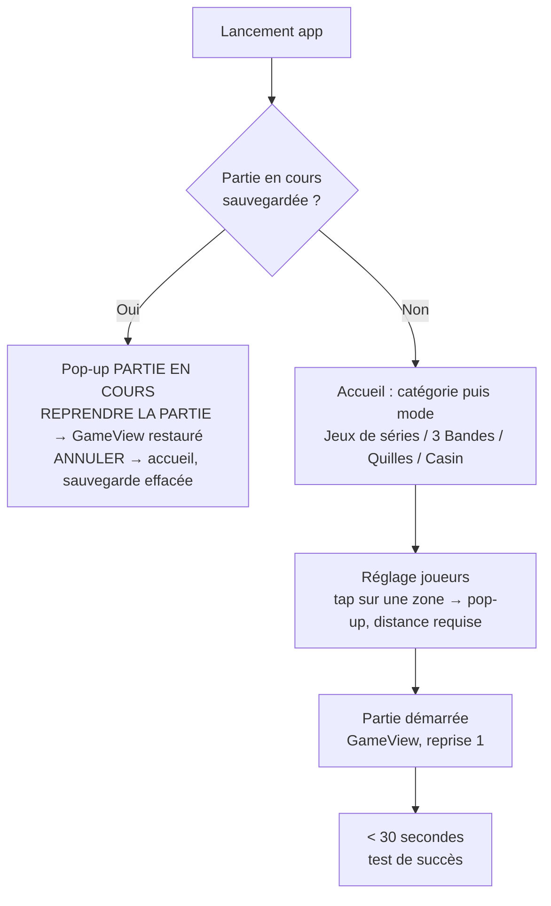
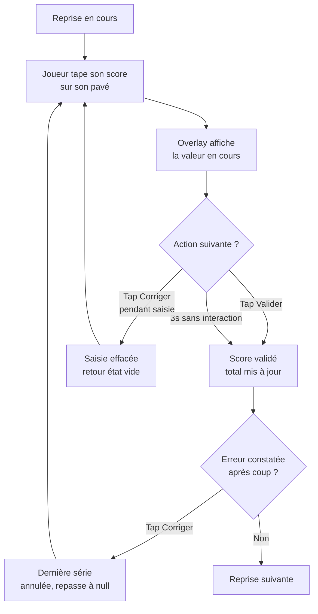
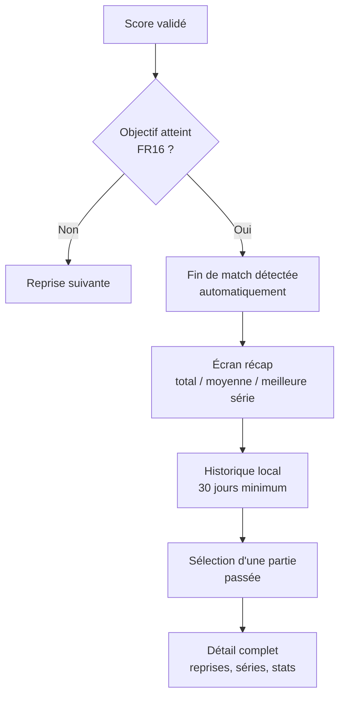

# UX Design Specification Carom Scoreboard → **1Score** *(renommé le 2026-09-11, Epic 10)*

**Author:** Nathan
**Date:** 2026-09-07

---

<!-- UX design content will be appended sequentially through collaborative workflow steps -->

## Executive Summary

### Project Vision

Scoreboard tablette pour billard carambole français — produit **1Score** depuis le 2026-09-11 — PWA offline-first, expérience "MVP délectable" avant tout, avec une trajectoire V1→V4 vers l'infrastructure de données de la fédération française.

### Target Users

- **Michel** (63 ans, joueur de club) — zéro formation, doit démarrer une partie seul en moins de 30 secondes
- **Didier** (responsable de club, peu tech) — reçoit et installe le matériel sans accompagnement technique
- V2/V3 (hors scope de cette session UX V1) : arbitres, organisateurs de tournoi, streameurs

### Key Design Challenges

- **Correction anxiety-free** : le risque UX #1 identifié par Nathan est la peur de l'erreur sans recours — un joueur senior qui se trompe de saisie doit immédiatement voir comment corriger, sans crainte de "casser" la partie. Le bouton d'annulation/correction doit être aussi visible et rassurant que le pavé de saisie lui-même, jamais traité comme une action "avancée" ou cachée.
- **Distance de lecture vs esthétique saturée** : conserver la lisibilité à 2m (score) et 5m (vue salle V2+) tout en adoptant des couleurs vives pleine-surface façon coréenne, sans sacrifier le contraste WCAG AA (NFR10).
- **Identité par la bille, fixée au côté** *(révisé le 2026-09-08 — l'observation initiale « couleur assignée au joueur, pas à la position » était une erreur de lecture des références)* : gauche = blanche, droite = jaune, comme sur CUESCO et Billiboard ; le tour actif se signale par un liseré autour du panneau du joueur qui doit jouer, jamais par la teinte du bloc.
- **Décision de design system différée** : Nathan formalisera la palette/typo définitive plus tard à partir des captures d'écran coréennes (`explore/resources/`) ; en attendant, on travaille par patterns extraits de ces références (hiérarchie, couleur, feedback) plutôt que par tokens figés.

### Design Opportunities

- **Écran de fin de partie comme moment fort** : le format "battle" observé sur les systèmes coréens (bandeau VS, médaille winner/loser, stats comparées côte à côte) transforme le récapitulatif en moment gratifiant — aligné avec l'idée #23 du brainstorming (moments clés amplifiés).
- **Pattern couleur + bordure active** déjà validé sur le terrain coréen (CUESCO, Billiboard, VIEW LIFE) — réutilisable tel quel pour signaler visuellement qui doit jouer.
- **Différenciation vs. concurrence française** : aucun produit équivalent n'existe sur ce marché ; le ton "digital/esport" positionne d'emblée le produit comme premium/moderne face à la feuille papier.

**Direction visuelle retenue :** digital / esport coréen — couleurs saturées en blocs pleins, ambiance compétitive et gratifiante, écrans de résultat type "battle". Référence directe : les 20 captures d'écran de systèmes coréens dans `explore/resources/`.

## Core User Experience

### Defining Experience

Il n'y a pas une action cœur unique, mais **deux patterns de saisie distincts selon le mode de jeu**, que le `PlayerPanel` doit supporter sans changer de composant :

**1. Modes JDS (Libre, Cadre 47/2, 47/1, 71/2, 1 Bande, 4 Billes) — saisie différée au pavé numérique.** Peu d'alternances par reprise, scores élevés (10–100+). Le joueur saisit le score final de sa série au pavé après son tour.

**2. Mode 3 Bandes — incrémentation tactile en temps réel.** Scores rares et unitaires (séries souvent < 10 points). Ce n'est pas le joueur qui tire qui saisit : c'est **le joueur assis (non-actif)** qui tape sur sa propre zone pour ajouter un point à l'adversaire en train de jouer. Ce tap a un double rôle : marqueur de synchronisation caméra (coupe le rush vidéo au moment du point — fondation pour l'indexation vidéo V4) et reset du chrono de tir (40s), utile aussi en entraînement solo. Le pavé numérique reste disponible en backup pour saisir directement une série complète si l'adversaire oublie de taper au fil de l'eau.

### Platform Strategy

PWA tactile installée sur tablette, 100% offline en V1, cibles Android 10+ et iPadOS 15+, Pointer Events (pas de délai tactile 300ms), layout 3 colonnes paysage (décisions déjà actées en architecture).

### Effortless Interactions

Le calcul du score total, de la moyenne et de la meilleure série doit être entièrement invisible pour l'utilisateur — zéro calcul mental, à aucun moment (FR3, FR17).

### Critical Success Moments

- **Premier lancement** : Michel démarre seul, sans lire de texte, en moins de 30 secondes — doit fonctionner dès le premier contact, sans marge d'erreur.
- **Correction sans stress** : un joueur qui se trompe doit voir immédiatement et sans ambiguïté comment revenir en arrière — le point de rupture n°1 identifié pour la confiance dans l'outil.
- **Fin de partie** : la révélation automatique des stats ("8,75 de moyenne, c'est mon record") doit être le moment le plus gratifiant de la session, inspiré des écrans "battle" coréens.

### Experience Principles

1. **Un seul geste par mode, jamais d'ambiguïté** — le pattern de saisie change selon le mode de jeu (différé vs temps réel), mais reste unique et prévisible à l'intérieur d'un mode donné.
2. **L'erreur est réversible et visible** — la correction a la même importance visuelle que la saisie, jamais reléguée à un menu.
3. **Le calcul est invisible pour l'utilisateur** — totaux, moyennes, records : le système calcule, jamais le joueur.
4. **La fin de partie récompense** — un moment de reconnaissance visuelle/émotionnelle, pas un simple tableau de chiffres.

## Desired Emotional Response

### Primary Emotional Goals

Confiance sereine sous surface excitante — le joueur doit se sentir immédiatement en contrôle et en sécurité (jamais anxieux face à la technologie), tandis que l'écran lui-même dégage l'énergie compétitive d'un vrai jeu (ton "digital/esport").

### Emotional Journey Mapping

- **Découverte** (premier lancement) : rassurant, pas intimidant — zéro jargon, zéro écran de configuration complexe.
- **Pendant la partie** : fluide et presque invisible — le joueur pense à son jeu, pas à l'outil.
- **En cas d'erreur** : calme, jamais punitif — la correction doit se sentir "normale", pas comme un échec.
- **Fin de partie** : pic d'excitation et de fierté — le ton "battle" coréen s'exprime pleinement (Michel qui annonce fièrement sa moyenne).
- **Retour à l'usage** (partie suivante, historique) : fierté de la progression — voir sa moyenne évoluer dans le temps.

### Micro-Emotions

- **Confiance > Scepticisme** — critique pour Didier (admin peu tech) qui doit faire confiance à l'outil dès le déballage.
- **Calme > Anxiété** — sur la correction, le point de rupture UX n°1 identifié précédemment.
- **Fierté > Indifférence** — sur les stats de fin de partie et l'évolution dans l'historique.

### Design Implications

- **Confiance** → onboarding sans configuration, pictogrammes explicites, aucun texte explicatif requis pour démarrer (NFR12).
- **Calme sur l'erreur** → bouton de correction toujours visible et de même poids visuel que la saisie, jamais dans un sous-menu.
- **Fierté en fin de partie** → écran de résultat façon "battle" coréen (score comparé, record mis en avant), pas un simple tableau statique.

### Emotional Design Principles

1. **Rassurer avant d'impressionner** — la confiance prime sur l'esthétique à chaque étape où l'utilisateur pourrait douter (démarrage, correction).
2. **L'excitation se gagne, elle ne s'impose pas** — le ton compétitif s'exprime pleinement aux moments de succès (fin de partie, record), pas en permanence pendant la saisie.
3. **Aucune émotion négative ne doit provenir de l'outil lui-même** — confusion, peur de casser la partie, ou sentiment d'être jugé/lent sont à éliminer systématiquement, en particulier pour le public senior.

## UX Pattern Analysis & Inspiration

### Inspiring Products Analysis

Trois systèmes coréens réels servent de référence, avec des rôles différents :

**CUESCO** — leader historique du marché coréen (scoreboard officiel de la fédération coréenne et de l'UMB, fédération mondiale — validation forte de la stratégie "cheval de troie fédéral" du PRD). Sa brochure commerciale révèle le pattern le plus précieux : **une seule coque UI (2 panneaux joueur + console centrale) décline 6 modes de jeu très différents** (3-bandes, snooker, survival/pari, partie simple, mode "alphanumérique" façon Casin, pool/poches) — seuls le widget central et les boutons d'action changent. Référence **visuelle et structurelle** principale : blocs pleins, chiffre de score géant, peu d'éléments simultanés.

**Billiboard** — même famille visuelle épurée que CUESCO, confirme le pattern de console centrale simple (inning, chrono, bouton d'action unique).

**Billizone** — référence **fonctionnelle uniquement**, pas visuelle (son interface est plus chargée, thème sombre dense, jugée trop chargée). En retenir seulement deux idées : afficher le score restant vers l'objectif en plus du score courant, et nommer explicitement un bouton d'annulation de tour plutôt que de cacher cette action. *(Précision du 2026-09-09, Story 1.6 : le score restant est **propre au 3 Bandes** — il n'est pas affiché en jeux de série, où la série se rentre en bloc au pavé et où l'annonce « Pour n » n'a pas de sens.)*

### Transferable UX Patterns

- **Shell unique multi-modes** — 2 panneaux joueur + console centrale identiques quel que soit le mode de jeu ; seul le widget central et le bouton d'action rapide changent. Validé par 6 déclinaisons réelles chez CUESCO.
- **Chiffre de score géant, seul élément dominant** — confirmé sur l'ensemble des modes observés, pas une exception.
- **Saisie rapide simple** : un bouton **+1** unique (pas une rangée de boutons +2/+3/+5/+10) accompagné d'une affordance claire (icône pavé numérique) pour ouvrir la saisie complète quand la série vaut plus qu'un point. Le détail exact sera affiné en développement.
- **Score restant vers l'objectif** affiché à côté du score courant, dès qu'un format de match a un objectif (FR15). *Périmètre précisé le 2026-09-09 (Story 1.6) : **3 Bandes uniquement**, sous la forme de l'annonce d'arbitre `POUR 3` / `POUR 2` / `POUR 1` quand le restant vaut 3 ou moins — absent des jeux de série, où seule la distance brute reste en en-tête (Epic 2, Story 2.2).*
- **Bouton d'annulation nommé et visible** dans la console centrale, jamais un geste implicite.
- **Fin de partie façon "battle"** — bandeau VS, médaille, tableau comparatif.

### Anti-Patterns to Avoid

- **Surcharge de la console centrale** (l'anti-pattern Billizone) — trop d'éléments simultanés, thème dense, nuit à la lisibilité pour un public senior novice.
- **Design daté façon "concurrents grisâtres"** — identifié par CUESCO lui-même dans sa propre brochure comparative : UI dense, contrastes gris/noirs, boutons ronds mal hiérarchisés.
- **Rangées de boutons rapides multiples** (+1/+2/+3/+5/+10) — écarté par Nathan au profit d'un unique bouton +1 plus une ouverture claire vers le pavé complet.
- **Textes/jargon non traduit ou peu clair** — confirme NFR12.

### Design Inspiration Strategy

**À adopter :** shell unique multi-modes en 3 blocs (CUESCO/Billiboard) ; chiffre de score géant dominant ; bouton +1 simple + affordance pavé numérique ; score restant vers l'objectif (idée Billizone, habillage épuré — **3 Bandes uniquement**, voir ci-dessus) ; bouton d'annulation nommé et visible ; écran de fin façon "battle".

**À adapter :** simplifier la densité de la console centrale en V1 (pas de caméra, pas de pari social) ; garder le pavé numérique complet comme option universelle sur tous les modes.

**À éviter :** empilement d'éléments dans la console centrale ; design daté façon concurrents ; rangées de boutons rapides multiples ; toute fonctionnalité demandant lecture/familiarité préalable.

## Design System Foundation

### 1.1 Design System Choice

Design System **Custom**, construit en composants Vue + utilitaires Tailwind CSS v4 — pas de librairie de composants établie (Material, Ant Design, MUI, Chakra).

### Rationale for Selection

- Cohérent avec la stack déjà actée en architecture (Tailwind CSS v4, sans librairie de composants).
- Nécessaire pour reproduire l'esthétique "blocs pleine couleur + chiffre géant" (référence CUESCO/Billiboard), qui ne correspond à aucun design system établi — leurs composants par défaut tireraient vers un look générique de startup, à l'opposé de la direction visuelle retenue.
- Le nombre de composants réels du produit est faible (`PlayerPanel`, `CenterPanel`, `NumericPad`, `HomeScreen`, `ActionBar`, `GameSummary`) — un système custom léger n'est pas un fardeau de maintenance dans ce contexte.

### Implementation Approach

Composants Vue 3 (`<script setup>`) stylés directement en utilitaires Tailwind, sans couche d'abstraction de composants tierce. Les tokens de design (couleurs, typographie, espacements) sont construits au fil des prochaines étapes de cette session UX, à partir des captures CUESCO/Billiboard.

### Customization Strategy

Aucune palette figée à ce stade — Nathan formalisera la palette/typo définitive plus tard à partir des captures coréennes. En attendant, les décisions de fondation visuelle (étape suivante) et de direction de design s'appuient directement sur les patterns déjà identifiés (blocs pleins, couleur par joueur, chiffre dominant).

## 2. Core User Experience

### 2.1 Defining Experience

Saisir le score d'une série et le voir validé sans effort ni doute — que ce soit par un tap explicite sur un bouton "Valider", ou par simple inaction pendant 3 secondes. C'est l'interaction que Michel décrirait à un copain de club : "je tape mon score, ça s'enregistre tout seul."

### 2.2 User Mental Model

Transposition directe de gestes déjà connus, sans nouveau concept à apprendre :
- **Modes JDS** : le bloc-notes papier devient un pavé numérique — modèle mental de calculatrice/téléphone.
- **3 Bandes** : le compteur mécanique à main déjà utilisé par les arbitres devient un tap incrémental sur écran.
- **Validation hybride** : déjà rencontrée par les joueurs sur les scoreboards électroniques existants en club (on tape le nombre, ça se valide tout seul) — aucune éducation utilisateur requise.

### 2.3 Success Criteria

- Le joueur ne se demande jamais "est-ce que c'est validé ?" — l'état de la saisie est toujours visible sans ambiguïté.
- Retour visuel/haptique immédiat, < 100 ms après chaque tap (NFR1).
- La correction est accessible aussi facilement que la validation, à tout moment — pendant la fenêtre des 3 secondes (annuler la saisie en cours) et après (annuler la dernière série validée).

### 2.4 Novel UX Patterns

Entièrement établi, aucune innovation d'interaction risquée : pavé numérique (pattern calculatrice/téléphone) et tap incrémental (pattern compteur manuel d'arbitre). Le seul élément à mi-chemin entre les deux — validation hybride bouton explicite + auto-validation à 3s — reste familier car déjà rencontré sur les scoreboards électroniques de club existants.

### 2.5 Experience Mechanics

**Modes JDS (les six variantes)** — *réécrit le 2026-09-09 (Story 1.5). La version précédente plaçait le pavé en permanence dans le panneau joueur et la valeur en cours dans un overlay sur son bloc : les deux sont **caducs**, le pavé mangeait la place du score, qui est l'information à lire à distance.*
1. **Initiation** : le panneau joueur ne porte **aucun pavé**. La saisie s'ouvre par un bouton **`AJOUTER LES POINTS`** dans la barre basse, large comme le bloc joueur et placé du côté du joueur qui **n'a pas** la main — au billard, c'est l'adversaire assis qui compte les points de celui qui joue. Le picto de sortie occupe la colonne opposée ; les deux échangent de place à chaque bascule de tour *(mise à jour 2026-09-10, Story 1.15 : les pictos de sortie **et de recommencement** occupent la colonne opposée, la sortie au bord extérieur)*.
2. **Interaction** : le pavé vit dans une **pop-up** (`ScoreEntryModal`), qui reprend la coquille de `PlayerSetupModal` pour que les deux pop-ups du produit se ressemblent. La valeur en cours s'y affiche en grand, dans la couleur du joueur.
3. **Feedback** : chaque tap déclenche un retour haptique + visuel immédiat ; `VALIDER` porte un compte à rebours visible, l'auto-validation ne devant pas être silencieuse — d'autant qu'elle fait aussi changer le tour.
4. **Complétion** : validation par tap explicite sur `VALIDER` OU automatiquement après 3 secondes d'inactivité — les deux chemins aboutissent au même état et referment la pop-up. **La validation d'une série emporte la bascule du tour** (voir la règle d'alternance ci-dessous). Refermer sans valider n'enregistre rien et ne laisse aucun buffer résiduel.
5. **Ce qui reste dans le panneau** : le **score, aussi grand que la carte le permet** (sa taille s'adapte au nombre de chiffres), un en-tête d'une seule ligne portant nom, moyenne, meilleure série et distance, et deux boutons `−` / `+` en pied qui corrigent le total **sans toucher au déroulé** — ni reprise, ni bascule de tour.

**Une seule saisie à la fois.** Conséquence assumée du CTA unique : on ne peut plus saisir pour le joueur qui n'a pas la main. Le rattrapage d'une série oubliée passe par ANNULER (Story 1.8) *(absorbée par la Story 1.7, 2026-09-09 : `ANNULER` remonte d'une action par appui, on annule jusqu'avant la série oubliée puis on la ressaisit)*.

**Règle d'alternance et de moyenne (portée générale, actée le 2026-09-09)** — elle conditionne les Stories 1.6, 1.10, 1.11 et tout l'Epic 2, et ne se limite pas à la Story 1.5 :
- **Rentrer sa série, c'est rendre la main.** Dans les modes qui passent par le pavé numérique (JDS), valider une série bascule le joueur actif, sans aucun geste supplémentaire — par le bouton `VALIDER` comme par l'auto-validation à 3 s, qui devient donc aussi le *fallback* de bascule. **Rendre la main sans marquer** se fait au **tap sur la zone de l'adversaire** : le total ne bouge pas, mais une **série de 0 est bien enregistrée** — une reprise blanchie reste une reprise jouée, et l'ignorer ferait monter artificiellement la moyenne. En 3 Bandes (Epic 2), où la série ne passe pas par un pavé, la bascule reste un geste explicite. ***Supersédé le 2026-09-11 (Epic 10)** — voir « Refonte UI/UX Premium — 1Score », §10.3 Scoreboard : le tap sur la carte adverse est **retiré**, `PASSER LE TOUR` (colonne centrale) devient l'unique geste de passage sans marquer, en JDS (série de 0 enregistrée) comme en 3 Bandes ; la bascule automatique à la validation d'une série ne change pas.*
- **La reprise est ouverte par le joueur blanc.** *(2026-09-11, Epic 10 : « joueur blanc » se lit **joueur à la bille blanche**, où qu'il soit à l'écran — les billes peuvent avoir été changées sans déplacer les joueurs, voir §10.3 Paramétrage.)* C'est toujours le joueur de gauche qui « met les reprises » : le compteur avance quand il **reprend** la main, pas quand il la rend. Une série du seul joueur blanc laisse donc l'affichage sur « REPRISE 1 » *(libellé `REP` depuis la Story 1.7, 2026-09-09)*.
- **La moyenne d'un joueur se fige quand il rend la main** : celle du blanc quand il rend la main, celle du jaune quand le blanc la reprend. Une reprise entamée mais non terminée par un joueur n'entre pas dans sa moyenne ; une reprise **blanchie**, en revanche, y compte.

**Mode 3 Bandes** (rappel step 2.1 de l'étape 3) : le joueur assis tape sa propre zone pour incrémenter le score de l'adversaire en train de jouer, avec le pavé numérique disponible en backup pour saisir une série complète directement.

**Règles de fin de partie** *(ajouté le 2026-09-10, Story 1.10 — règles données par Nathan, valables en JDS ; au 3 Bandes l'égalisatrice sera un réglage de l'Epic 2)* :
- **Chaque joueur a sa distance** (obligatoire au démarrage) et **le blanc ouvre toujours**. La série qui amène un joueur à sa distance est **plafonnée au restant** : on s'arrête à la distance, tout dépassement est une erreur de saisie.
- **Le blanc atteint sa distance le premier** → il a joué une reprise de plus. Une pop-up « MICHEL A ATTEINT SA DISTANCE » attend une décision par ses deux seuls CTA, sans message ni croix : `ANDRÉ JOUE` / `FIN DE PARTIE` *(libellés arrêtés en revue au rendu, 2026-09-10)*. `ANDRÉ JOUE` : retour au scoreboard, le jaune joue **une** série — s'il atteint sa distance, **égalité**, sinon **le blanc gagne** ; dans les deux cas la partie se termine. `FIN DE PARTIE` : le blanc gagne, récap direct. Aucun signal visuel particulier sur le scoreboard pendant la reprise égalisatrice — la pop-up a suffi.
- **Le jaune atteint sa distance le premier** → il **gagne immédiatement**.
- **Pop-up « PARTIE TERMINÉE »** réduite au titre et à `VOIR LE RÉCAP` — ni vainqueur annoncé, ni croix *(revue au rendu, 2026-09-10 : le résultat se lit sur le récap, on ne revient pas au scoreboard)*. Une série gagnante mal saisie n'est donc plus rattrapable une fois la fin détectée — accepté. Le récap est terminal.
- **`ÉCHANGER` est bloqué pendant la reprise égalisatrice** *(**Supersédé le 2026-09-11 (Epic 10)** — voir « Refonte UI/UX Premium — 1Score », §10.3 : `ÉCHANGER` **n'existe plus en cours de partie** ; la règle devient sans objet.)* : le drapeau est attaché au côté droit, un échange ferait jouer l'égalisatrice au joueur qui vient d'atteindre sa distance et fabriquerait une égalité fantôme *(revue de code 1.10, décision de Nathan, 2026-09-10)*.
- **La détection ne réagit qu'aux séries** (validation au pavé, auto-validation, main rendue) — jamais aux corrections `−`/`+` ni à `ÉCHANGER`.
- **Fin manuelle** (picto de sortie, avec au moins une série) : pop-up « TERMINER LA PARTIE ? » avec `VOIR LE RÉCAP` et `ANNULER` → récap, **vainqueur au prorata** (`score / distance` le plus élevé ; égalité si égal). Sans série, le picto ramène directement à l'accueil.
- **Égalité = résultat final** pour l'instant ; la prolongation viendra plus tard.
- **Recommencer** *(ajouté le 2026-09-10, Story 1.15)* : picto à côté de la sortie (flèche circulaire, grisé sur un scoreboard intact), confirmation « RECOMMENCER LA PARTIE ? » (`RECOMMENCER` / `ANNULER`) : la partie repart de zéro **sur place**, mêmes joueurs, distances et côtés, le blanc a la main, **sans récap** et sans retour à l'accueil — elle n'a jamais été terminée (rien pour l'historique, Epic 3).

## Visual Design Foundation

*Extraction de première passe réalisée par l'agent à partir des captures CUESCO/Billiboard déjà analysées — approximative (pas de pixel-picking), destinée à driver les décisions Tailwind initiales. Nathan formalisera le système définitif plus tard à partir de ses propres outils d'extraction.*

### Color System

**Fond général :** noir/bleu-nuit très sombre (proche `#0D1117` à `#000000`) — fond dominant de la console centrale et des écrans de résultat "battle", pour un contraste maximal avec les blocs joueurs.

**Couleurs joueur** (bille fixe par côté — révisé le 2026-09-08) :
- **Gauche = bille blanche** : bloc plein blanc `#FFFFFF`, chiffres noirs.
- **Droite = bille jaune** : bloc plein jaune doré `#FFC72C`, chiffres noirs.

La couleur suit la bille, et la bille est attachée au côté de l'écran — comme sur CUESCO et Billiboard. Un bouton d'interversion (console centrale, disponible avant la première reprise) échange les deux joueurs de côté ; on ne repeint jamais un panneau. *(**Supersédé le 2026-09-11 (Epic 10)** — voir « Refonte UI/UX Premium — 1Score », §10.3 Paramétrage : deux actions indépendantes avant `DÉMARRER`, `CHANGER DE BILLE` et `CHANGER DE CÔTÉ` — la carte de gauche peut donc être jaune ; la couleur suit toujours la bille. Fond général : dégradé du bleu du drap vers le noir, tokens en §10.1.)*

Le joueur dont c'est le tour est encadré d'un liseré rouge épais (`--color-turn-active`) : c'est la présence du cadre, et non sa teinte, qui porte l'information (UX-DR14).

**Accent système** (bouton d'action neutre — "passer le tour", "+1") : bleu vif `#1E88E5`, volontairement distinct des couleurs joueur pour ne jamais créer de confusion entre "marquer un point" et "action système".

**Alerte/urgence** (chrono, décompte) : rouge LED `#FF3B30` sur fond noir.

**Victoire/récompense** : or `#FFD54A` + ruban rouge `#E63946` pour la médaille de fin de partie.

### Typography System

Sans-serif très grasse (graisse 800–900) pour le chiffre de score — seul élément qui doit dominer visuellement l'écran. Labels (nom joueur, AVG, HR, score restant) en sans-serif medium/bold (600–700), nettement plus petits.

Suggestions de polices web (à confirmer/remplacer lors de la formalisation définitive) :
- **Inter** ou **Manrope** pour les labels et l'UI générale — excellente lisibilité, chiffres tabulaires.
- **Barlow Condensed (Black)** ou **Rajdhani (Bold)** pour le chiffre de score géant — ton "digital/esport".

Échelle indicative : score ~120–200px+ (fluide via `clamp()`, NFR10), nom/labels ~16–24px, stats secondaires ~14–18px.

### Spacing & Layout Foundation

Unité de base 8px (standard Tailwind). Les blocs joueur occupent quasiment 100% de leur colonne, sans marge décorative — la densité vient de la taille des éléments, pas de leur nombre. Zones tactiles ≥ 90×90px pour tous les éléments interactifs (NFR9).

### Accessibility Considerations

- Contraste WCAG AA : texte noir sur jaune/blanc (excellent), texte blanc sur bleu-nuit/rose foncé (à valider précisément selon la teinte finale retenue).
- Typographie fluide `clamp()` pour rester lisible à 2m (score, NFR10) et 5m en vue salle V2+ (NFR11).

### Écran d'accueil et navigation *(ajouté le 2026-09-08)*

**Accueil = veille + sélection, sur un seul écran.** Il n'y a pas de bouton de démarrage intermédiaire : l'écran au repos présente directement, dans un bandeau bas façon Billiboard, les catégories de jeu sous forme de grandes cartes (libellé + sous-titre énumérant les variantes). Le haut de l'écran reste disponible pour l'identité du club et, plus tard, les informations de veille.

**Navigation à deux niveaux.** Une catégorie regroupant plusieurs modes ouvre un second niveau listant ses modes ; une catégorie à mode unique passe directement à l'étape suivante. Les catégories dont aucun mode n'est encore livrable restent **affichées mais inertes**, marquées « BIENTÔT » : l'écran donne à voir l'ambition du produit sans mentir sur ce qui fonctionne.

**Sélection des joueurs.** Deux grands panneaux côte à côte portant déjà la bille de leur côté (blanc à gauche, jaune à droite). Taper une zone ouvre la pop-up de réglage de **ce joueur-là** (nom + distance) : la zone du joueur *est* le point d'entrée, il n'y a pas de bouton de réglage dans la barre d'action. Cette structure préfigure la sélection depuis la base joueurs du club (Epic 4) sans avoir à être redessinée. *(2026-09-11 : l'Epic 4 est avancé en V2a — la zone joueur ouvrira « qui joue ? » : recherche par nom, code, ou invité.)*

**Réglage par joueur — nom optionnel, distance obligatoire — sans écran supplémentaire** *(**Supersédé le 2026-09-11 (Epic 10)** — voir « Refonte UI/UX Premium — 1Score », §10.3 Paramétrage : la pop-up joueur disparaît, chaque champ se règle **en place** — pavé nu en colonne centrale pour la distance, clavier en bandeau bas pour le nom ; le rattrapage « DISTANCE MANQUANTE » subsiste.)* *(ajouté le 2026-09-08, réécrit le 2026-09-09, Story 1.4 ; distance rendue obligatoire le 2026-09-10, Story 1.10 : `DÉMARRER` sans distance ouvre une pop-up d'erreur « DISTANCE MANQUANTE » à deux CTA `RÉGLER LA DISTANCE` / `ANNULER`, dont le premier ouvre la pop-up du premier joueur sans distance directement sur ce champ, puis celle du jaune à la suite si elle manque encore — un seul geste de rattrapage, pas un par joueur)*. Le nom et la distance d'un joueur se règlent en tapant **sa propre zone** à l'étape joueurs, qui ouvre une pop-up dédiée. Aucun bouton de réglage n'encombre la barre d'action : le parcours par défaut reste `catégorie → mode → joueurs → jeu`, et ignorer les réglages ne coûte aucun geste. **Aucun mode ne porte de distance par défaut** — le libellé d'attente est `0`, aucun objectif — et la distance appartient au **joueur**, pas à la partie : le handicap est simplement la conséquence de deux saisies indépendantes, sans mode « lié » ni action de dissociation. Sur le scoreboard, un joueur sans distance n'affiche rien à cet emplacement.

**Saisie sur borne fixe : claviers intégrés, clavier système exclu** *(ajouté le 2026-09-09)*. L'écran cible est **fixé**, pas pris en main. Le clavier du système, dont ni la taille ni l'apparence ne sont contrôlables et qui recouvre 40 à 50 % de l'écran, est donc proscrit : toute saisie passe par des claviers dessinés dans l'application. La garantie est **structurelle** — les modales de saisie ne contiennent aucun champ natif, les valeurs sont du texte affiché alimenté par nos claviers — et non un simple attribut `inputmode`. Conséquence assumée : un clavier alphabétique à 10 colonnes ne peut pas tenir la cible de 90×90 px dans une pop-up à 768 px de large (touches ≈ 57 px, comme le clavier natif de l'iPad) ; la règle des 90 px reste entière pour les commandes de jeu.

**Barre d'action permanente.** *(**Supersédé le 2026-09-11 (Epic 10)** — voir « Refonte UI/UX Premium — 1Score », §10.2 : la barre basse **disparaît des écrans hors jeu**, remplacée par une **barre latérale gauche contextuelle** ; elle ne subsiste que sur le scoreboard, reconstruite en picto + libellé.)* Une barre basse est présente sur **tous** les écrans, scoreboard compris. Sur les écrans de navigation, le retour occupe toujours la même position à gauche et la partie droite accueille les actions contextuelles (démarrer). C'est aussi elle qui réduit légèrement la hauteur dévolue au score sur le scoreboard, comme sur les systèmes coréens de référence.

*Exception assumée sur l'écran de partie (Story 1.5, 2026-09-09)* : la barre y est calée sur les colonnes des panneaux, et **le CTA de saisie comme la sortie changent de côté** à chaque bascule de tour — le CTA suivant le joueur assis, la sortie occupant la colonne opposée. La règle « un contrôle de navigation ne se déplace jamais » cède ici devant une règle plus forte : le CTA doit se trouver sous la main de celui qui compte les points. La sortie y est réduite à un picto, sans libellé, pour ne pas concurrencer le CTA.

## Design Direction Decision

### Design Directions Explored

5 pistes construites sur la fondation visuelle commune (couleurs, typographie, espacements de l'étape 8), documentées avec mockups interactifs dans `ux-design-directions.html` : Bloc Plein (fidèle à CUESCO/Billiboard), Contour Néon (fond sombre, couleur en contour/glow plutôt qu'en aplat), Salle Feutrine (vert billard + laiton en clin d'œil à l'identité "salle de billard classique"), Minimal Radical (tout sauf le score et la correction disparaît de l'écran principal), Battle Permanent (bandeau "VS" affiché en continu pendant le jeu, pas seulement en fin de partie).

### Chosen Direction

**Bloc Plein** — blocs pleine couleur par joueur, chiffre de score géant dominant, console centrale minimale. *(Raffiné le 2026-09-11, Epic 10, en **« Bloc Plein contenu »** : mêmes blocs, chacun dans un conteneur à contour, sur un dégradé drap → noir — voir §10.0.)* C'est la direction la plus fidèle aux références coréennes déjà validées sur le terrain (CUESCO/Billiboard).

**Exigence de symétrie stricte :** les deux panneaux joueur doivent être autonomes et symétriques — chacun porte ses propres contrôles de saisie (ex. bouton +1), aucune fonction de score n'est centralisée dans la console centrale. La console centrale reste réservée aux éléments neutres/partagés (mode de jeu, numéro de reprise), jamais à une action qui avantagerait un ordre de saisie sur l'autre. *(2026-09-11, Epic 10 : `PASSER LE TOUR` y entre — action symétrique, elle rend la main quel que soit le joueur actif ; le dock de saisie s'y superpose le temps d'une saisie, sans y écrire de score.)*

### Design Rationale

- Fidèle à une référence déjà éprouvée en club, pas une invention à valider from scratch.
- La symétrie garantit que les deux joueurs vivent exactement la même expérience quelle que soit leur position à l'écran : les deux panneaux portent les mêmes contrôles. Seule la bille diffère (gauche blanche, droite jaune), et le bouton d'interversion permet de choisir son côté avant la première reprise.

### Implementation Approach

Le détail précis des contrôles par panneau (disposition du bouton +1, accès au pavé numérique complet, bouton de correction) sera affiné au moment du développement, en s'inspirant directement des captures Billiboard plutôt que figé dès maintenant dans cette spec.

## User Journey Flows

Trois flows critiques du scope V1a, issus des parcours PRD (Michel happy path, Michel correction, détection de fin de match). Le flow du mode 3 Bandes (tap incrémental) suit le même squelette que le Flow 2 et n'est pas dupliqué ici.

### Flow 1 — Démarrer une partie

*Note (2026-09-11, `sprint-change-proposal-2026-09-11.md`)* : au jalon **V2a (profil joueur)**, l'étape « Réglage joueurs » devient « **qui joue ?** » — la zone joueur ouvre trois chemins : **recherche du nom** parmi les joueurs enregistrés, **saisie d'un code**, ou **invité** (chemin le plus court, seul disponible sans réseau). Contrainte inchangée : moins de 30 secondes, sans lecture de texte. Le tiret et l'apostrophe manquants au clavier alphabétique (revue 1.4) deviennent nécessaires pour la recherche par nom.

### Flow 2 — Saisir & Corriger un score (le cœur du produit)

***Supersédé le 2026-09-11 (Epic 10)** — voir « Refonte UI/UX Premium — 1Score », §10.5 : « pavé » se lit **dock central**, `ANNULER` est dans la barre basse, `PASSER LE TOUR` remplace le tap adverse.*

*Note (Story 1.7, 2026-09-09)* : « Tap Corriger pendant saisie » est la touche `C` (ou `⌫`, ou la croix) de la pop-up — pas un bouton distinct. « Dernière série annulée, repasse à null » se lit désormais « **état d'avant la dernière action restauré** » : le bouton est `ANNULER` en console centrale, il remonte d'une action par appui, et ce chemin vaut aussi pour une main rendue sans marquer et pour une correction `−`/`+`. L'échange de côtés, lui, n'y passe jamais.

### Flow 3 — Terminer une partie & consulter l'historique

*Note (2026-09-10, Story 1.10)* : entre « fin de match détectée » et « écran récap » s'intercale une **pop-up de décision** — l'offre de **reprise égalisatrice** quand c'est le blanc qui atteint sa distance, puis « PARTIE TERMINÉE » avec `VOIR LE RÉCAP` seul — sans croix, une fin détectée n'est pas rattrapable (revue au rendu, 2026-09-10). Voir « Règles de fin de partie » en §2.5. Le picto de sortie mène lui aussi au récap, après confirmation.

*Note (2026-09-11)* : « Historique local 30 jours » est **abandonné** — la partie close est enregistrée localement puis **synchronisée vers les profils** des joueurs identifiés ; la consultation se fait **depuis le profil d'abord, depuis la tablette du club ensuite** (une fois identifié). Voir `sprint-change-proposal-2026-09-11.md`.

### Journey Patterns

- **Reprise après interruption** : toute fermeture accidentelle doit retomber sur "Reprendre la partie", jamais sur une perte silencieuse (NFR5, NFR6).
- **Boucle de correction symétrique** : le chemin "Corriger" est toujours accessible depuis n'importe quel état de saisie, jamais un cul-de-sac.
- **Détection automatique de fin** : aucune action manuelle "terminer le match" n'est nécessaire quand l'objectif est atteint — le système bascule seul vers le récapitulatif.
- **Mise à jour de l'application** : appliquée à l'accueil (écran de veille), jamais pendant une partie, sans pop-up ni toast (Story 1.13, 2026-09-10).

### Flow Optimization Principles

- Minimiser les étapes vers la première saisie de score (flow 1 en 3 écrans max, cohérent avec l'idée #11 du brainstorming).
- Le chemin d'erreur (Corriger) ne doit jamais être plus long que le chemin nominal.
- Le moment de gratification (récap fin de partie) doit être atteint sans action supplémentaire de l'utilisateur.

## Component Strategy

### Design System Components

Aucun — le design system est **Custom** (étape 8). Aucun composant équivalent à `PlayerPanel`, `NumericPad`, `CenterPanel`, `HomeScreen` ou `GameSummary` n'existe dans une librairie établie ou headless : ce sont des composants entièrement spécifiques au scoreboard de billard.

**Décision écartée en cours de route :** l'ajout d'une librairie de primitives headless (type Radix/reka-ui) pour la sélection de mode a été envisagé puis abandonné — son bénéfice principal (accessibilité clavier : piège de focus, navigation Tab, Échap) ne s'applique pas à un produit **100% tactile** sur tablette de club, et rien dans le PRD ne requiert de support lecteur d'écran. Ajouter cette dépendance serait allé à l'encontre du principe architecture "zéro abstraction complexe".

### Custom Components

**PlayerPanel** (×2, symétriques) *(fiche réécrite le 2026-09-09, Story 1.5)* — ***Supersédé le 2026-09-11 (Epic 10)** — voir « Refonte UI/UX Premium — 1Score », §10.3 Scoreboard : bandeau NOM / DISTANCE / RESTANT, MOY·SÉRIE sous le score, zone de série en pied, conteneur à contour, **plus tapable**.*
- *Rôle* : **lire** l'état du joueur. Le score y est aussi grand que la carte le permet — c'est l'information à voir depuis la table. En-tête d'une **seule ligne** : nom, moyenne de la partie en cours, meilleure série, distance. En pied, deux boutons `−` / `+` corrigeant le total sans toucher au déroulé de la partie.
- *Score restant* *(précisé le 2026-09-09, Story 1.6)* : **aucun** en jeux de série — la distance brute de l'en-tête suffit, la série se rentrant en bloc au pavé. Le compte à rebours est **propre au 3 Bandes** (Epic 2, **livré en Story 2.4, 2026-09-11**) : `POUR 3` / `POUR 2` / `POUR 1` dès que `distance − score` vaut 3 ou moins, placé **sous le score, entre `−` et `+`** ; masqué en distance libre. Convention d'annonce de l'arbitre, qui suppose un score avançant point par point. Taille `clamp(18px, 7.5cqw, 44px)` en largeur de panneau, sans retour à la ligne : en portrait il reste 105 px entre les deux boutons de 90.
- *Ce que le panneau ne porte plus* : le pavé numérique et l'overlay de saisie, partis en pop-up (voir §2.5). Un panneau qui n'a pas la main est **tapable** : il rend la main au joueur adverse.
- *États* : au repos · actif (c'est son tour) · tapable pour rendre la main (panneau inactif).
- *Règles de mise en page* : la taille du score suit le **nombre de chiffres** (1 à 4 — le plafond de 999 porte sur une série, pas sur le total), chaque palier bornant largeur, hauteur et plafond absolu. La densité de l'en-tête est réglée par la largeur du **panneau** (container query) et non de l'écran : il fait 410px en paysage, 307px en portrait. Si la ligne ne tient pas, seul le **nom** est tronqué — jamais une valeur chiffrée, qui deviendrait fausse à la lecture.
- *Accessibilité* : zones tactiles ≥90×90px ; le tour actif ne doit pas reposer uniquement sur la couleur du liseré — un joueur daltonien doit pouvoir distinguer "actif/inactif" autrement (intensité, icône, position), pas seulement sa teinte.

**NumericPad** — *(2026-09-11, Epic 10 : hébergé désormais par `NumericPadDock` en colonne centrale, style contour ; reste muet.)*
- *Rôle* : saisie d'un nombre — score d'une série dans `ScoreEntryModal` (Story 1.5), distance d'un joueur dans `PlayerSetupModal` (Story 1.4). Composant **muet** : ni buffer, ni plafond, ni timer, ni haptique — ce sont ses hôtes qui les portent.
- *États* : vide (touche d'effacement libellée `AC`) · saisie active (libellée `C`) · valeur hors limites (>999, FR7).
- *Disposition* : `1`-`9`, puis `AC`/`C` · `0` · `⌫` sur le rang du bas — plein, avec le `0` sous le `8`, là où le doigt le cherche.
- *Accessibilité* : plancher de **60px sur les deux axes** — l'exception UX-DR8 des claviers intégrés, et non les 90px des zones de commande : trois colonnes à 90px exigent 302px de large, que le panneau ne peut pas offrir en portrait. Retour haptique + visuel <100ms (NFR1), porté par le composant hôte.

**PlayerSetupModal** *(ajouté le 2026-09-09, Story 1.4)* — ***Supersédé le 2026-09-11 (Epic 10)** — voir « Refonte UI/UX Premium — 1Score », §10.4 : **supprimé**, remplacé par la saisie en place (dock + bandeau clavier).*
- *Rôle* : régler le **nom et la distance d'un seul joueur**, en tapant sa zone à l'étape joueurs. Vraie pop-up (AR6) : carte centrée, page visible mais floutée derrière. Trois issues : la **croix en haut à gauche** et le **tap en dehors de la carte** abandonnent, `VALIDER` — sur toute la largeur de la carte — applique.
- *États* : champ `NOM` visé (clavier alphabétique affiché) · champ `DISTANCE` visé (pavé numérique affiché) · libellés d'attente grisés (`JOUEUR`, `0`) tant que rien n'est saisi · plafonds atteints (20 caractères, 3 chiffres — la frappe suivante est ignorée sans message bloquant).
- *Règles de mise en page* : un **seul emplacement de clavier**, pour que rien ne se déplace lors de la bascule ; en-tête, champs et `VALIDER` fixes, les touches se partageant la place restante — `VALIDER` reste visible quel que soit le clavier, sans jamais exiger de défilement.
- *Accessibilité* : le champ visé se distingue par la **présence** d'un liseré (`border-turn-active`), signal non-chromatique identique à celui du tour actif — jamais par la seule teinte. `@pointerdown` partout.

**ScoreEntryModal** *(ajouté le 2026-09-09, Story 1.5)* — ***Supersédé le 2026-09-11 (Epic 10)** — voir « Refonte UI/UX Premium — 1Score », §10.4 : **remplacé** par `NumericPadDock` en colonne centrale, même contrat (VALIDER, 3 s, croix, geste complet sur le voile), valeur affichée entre `−` et `+` de la carte.*
- *Rôle* : saisir la **série du joueur qui a la main**, ouverte par `AJOUTER LES POINTS`. Même coquille que `PlayerSetupModal` — voile flouté, carte centrée, croix en haut à gauche, CTA en pied — pour que les deux pop-ups du produit se ressemblent.
- *États* : saisie vide (touche d'effacement `AC`, `VALIDER` inerte) · saisie en cours (`C`, compte à rebours de 3s sur `VALIDER`) · frappe refusée au plafond (pulsation de la valeur, haptique distincte).
- *Trois issues* : `VALIDER`, l'**auto-validation à 3s** (même état exactement), et l'abandon par la croix ou par un tap en dehors — qui n'enregistre rien.
- ⚠️ *Règle de fermeture par le voile* : le tap en dehors exige un geste **complet**, appui **et** relâchement sur le voile. Fermer au seul relâchement referme la pop-up à son ouverture même — le `pointerup` du geste qui a pressé le CTA retombe sur le voile fraîchement monté. Fermer au seul contact jette la saisie dès qu'une paume touche le fond. **La même règle s'applique à `PlayerSetupModal`.**

**AlphaKeyboard** *(ajouté le 2026-09-09, Story 1.4)* — *(2026-09-11, Epic 10 : en bandeau bas pleine largeur, complété du tiret, de l'apostrophe et de `Ë Ï Î Ô Û`.)*
- *Rôle* : saisir du texte sans jamais appeler le clavier du système (voir « Saisie sur borne fixe »). AZERTY sur 10 colonnes, rangée de chiffres en haut, accents `É È À Ç` des prénoms français, barre d'espace et retour arrière.
- *États* : normal · désactivé.
- *Cohérence* : partage son style de touche avec `NumericPad` (`keyClasses.ts`), pour que la bascule d'un clavier à l'autre au même emplacement soit invisible.

**CenterPanel** — ***Supersédé le 2026-09-11 (Epic 10)** — voir « Refonte UI/UX Premium — 1Score », §10.3 Scoreboard : réduit à `REP` · chrono · **`PASSER LE TOUR`** ; `ANNULER` part en barre basse, `ÉCHANGER` disparaît.*
- *Rôle* : contexte neutre partagé (**numéro de reprise**) et actions **symétriques** s'appliquant identiquement aux deux joueurs — annulation de la dernière série (ANNULER) et interversion des billes (ÉCHANGER). Jamais d'action qui favorise un joueur. *(Amendé en revue de la Story 1.3, 2026-09-08 ; puis en Story 1.5, 2026-09-09.)*
- *Modifié en Story 1.5* : le **mode de jeu n'y est plus affiché** — il est choisi au démarrage et n'évolue pas, la colonne est réservée à ce qui change en cours de partie. **ÉCHANGER reste disponible toute la partie**, et non plus jusqu'à la première série seulement.
- *Modifié en Story 1.7 (2026-09-09)* : **`ANNULER` est un *undo* multi-niveaux** — chaque appui revient d'une action en arrière (série validée, main rendue, correction `−`/`+`), jusqu'au début de la partie ; **grisé à pile vide**, jamais inerte en silence. **`ÉCHANGER` est hors pile** : il est son propre inverse, on rappuie dessus pour revenir, et une annulation ne le défait jamais par effet de bord. Les deux boutons portent **un mot, pas de glyphe** (`↩` et `⇄` retirés) ; le libellé au-dessus du compteur est **`REP`**.
- *États* : normal · alerte d'inactivité (FR43). *(Story 1.17 **annulée** le 2026-09-10 : une série de JDS peut durer plus d'une heure, l'inactivité de partie n'est pas un signal — l'état « alerte d'inactivité » ne sera pas construit ; la veille de la tablette, hors partie, relève de `HomeScreen`.)*
- *Note (Story 2.1, 2026-09-10)* : **chrono de tir du 3 Bandes** — composant dédié `ShotClock`, **uniquement en mode `3bandes`**, empilé **sous `REP`** et au-dessus d'`ANNULER`. **Anneau circulaire** SVG (libellé `CHRONO`, chiffre central en `text-reprise`) qui se vide **en continu** dans le sens horaire depuis midi, transition CSS d'une seconde calée sur le tick : **fond noir littéral, arc et chiffre rouge LED** (`--color-alert`, UX-DR4). Référence visuelle retenue : le « SHOT CLOCK » circulaire du CUESCO (`explore/resources/IMG_6034.JPG`), forme seulement (pas son bleu) ; **écartée** : la barre horizontale segmentée du Billiboard (`IMG_6459.JPG`), jugée « pas assez smooth » (paliers visibles). 40 s, figé à 0 sans autre effet ; repart plein à `RECOMMENCER` et `UNE PARTIE DE PLUS`. Pas de bouton pause (retiré du périmètre V1b). *Revue au rendu (Nathan, 2026-09-11)* : **couleur en fondu** vert (40 s) → jaune → orange → rouge (0 s), arc **et** chiffre — le rouge fixe est abandonné, UX-DR4 ne reste que comme point d'arrivée ; **plus de libellé `CHRONO`** (retiré par Nathan au second rendu), l'anneau se suffit. **Taille fluide** : l'anneau prend la place qui reste dans la colonne (unités de conteneur), jamais une largeur fixe — sur un iPad paysage avec la barre Safari, REP et ÉCHANGER étaient rognés. *Story 2.2* : relancé à 40 au `+1 POINT` et à la main rendue, **2 s de latence** avant le premier tick.

**HomeScreen** — ***Supersédé le 2026-09-11 (Epic 10)** — voir « Refonte UI/UX Premium — 1Score », §10.3 : sidebar, accroche, tuiles colorées ; état joueurs réécrit.*
- *Rôle* : écran d'accueil plein écran (Flow 1) — fait office de veille et porte la sélection de catégorie, de mode puis la saisie des joueurs.
- *États* : catégories · modes d'une catégorie · saisie des joueurs.

**ActionBar** — ***Supersédé le 2026-09-11 (Epic 10)** — voir « Refonte UI/UX Premium — 1Score », §10.2/§10.3 : **scoreboard uniquement** (sidebar ailleurs) ; CTA `+ POINTS ADVERSAIRE` / `+1 ADVERSAIRE` d'un côté, `QUITTER` · `PARAMÈTRES` · `RECOMMENCER` · `ANNULER` en picto + libellé de l'autre.*
- *Rôle* : barre d'action basse commune à tous les écrans — retour à position fixe à gauche, actions contextuelles à droite.
- *États* : retour seul · retour + action de démarrage.
- *Note (Story 2.2, 2026-09-11)* : en **3 Bandes**, le même CTA (même place, même gabarit, côté assis) s'intitule **`+1 POINT`** et crédite un point à celui qui joue, avec l'accusé haptique du pavé ; il n'ouvre pas le pavé. Rendre la main reste le **tap sur la carte** de l'assis, qui clôture la série comptée. **Pas de pavé de secours en 3 Bandes** (Story 2.3 annulée par Nathan, 2026-09-11) : `ScoreEntryModal` est le pavé des jeux de série, rien ne l'ouvre en 3 Bandes.
- *Note (Story 1.5, 2026-09-09, état final)* : en partie, la barre porte **`AJOUTER LES POINTS`** — large comme le bloc joueur, du côté du joueur **assis** — et le **picto de sortie** sur la colonne opposée, les deux échangeant de place à chaque bascule de tour. Le retour à place fixe d'`ActionBar` est donc désactivé sur cet écran (`showBack: false`) : une place fixe ne peut pas alterner. Les colonnes de la barre sont calées sur celles des panneaux (2/5 · 1/5 · 2/5), marges négatives comprises, sans quoi le CTA ne s'aligne pas sur le bloc.
- *Note (Story 1.15, 2026-09-10)* : la colonne opposée au CTA porte **deux pictos** — la **sortie** garde le bord extérieur de la barre, **RECOMMENCER** (flèche circulaire, `aria-label` « Recommencer la partie ») vient vers l'intérieur, séparés de 16 px ; même style (`bg-white/10`, `≥ 90×90 px`, `rounded-2xl`), les deux changent de côté avec le CTA. RECOMMENCER est grisé (`disabled`) tant qu'il n'y a rien à recommencer (`canUndo` faux, même critère que la sortie directe).
- *Amende UX-DR11* : « aucune action de score hors des panneaux » se lit désormais comme « aucune action qui **modifie** un score hors des panneaux ». Le CTA n'écrit rien : il **ouvre** la pop-up de saisie. Les corrections `−` / `+`, elles, sont bien restées dans les panneaux.
- *État « récap » (Story 1.10, 2026-09-10)* : sous l'écran de fin, la barre porte **deux CTA** sans retour — `FIN DE PARTIE` (neutre, à gauche → accueil) et `UNE PARTIE DE PLUS` (accent, à droite → revanche immédiate).

**GameSummary** *(fiche réécrite le 2026-09-10, Story 1.10 — format Billiboard, `explore/resources/IMG_6632.JPG`)* — *(2026-09-11, Epic 10, §10.3 Récap : conteneur à contour, sidebar `QUITTER` / `RECOMMENCER` à la place de la barre basse, nom et distance séparés dans le bandeau.)*
- *Rôle* : écran de fin de partie façon "battle" (Flow 3), qui **remplace** le scoreboard en plein écran — c'est un état de la partie, pas une pop-up. **Bandeau** haut `NOM / distance` **VS** `NOM / distance` (côté conservé : gauche = blanc), le mode de jeu en surtitre discret au-dessus du `VS`. En dessous, **trois colonnes** — joueur gauche, libellés, joueur droit — avec les lignes `RÉSULTAT` (`VICTOIRE` / `DÉFAITE` / `ÉGALITÉ` + bille), `POINTS`, `MOY` (3 décimales), `SÉRIE`, `REPRISES`. Aucune interaction dans le composant : le récap est **terminal**, la correction se fait avant la série gagnante (aucune pop-up de fin n'a de croix — revue au rendu, 2026-09-10).
- *États* : **vainqueur à gauche** ou **à droite** — sa colonne entière est en couleur **victoire** (ruban rouge `--color-victory-ribbon`, fidèle au rose/rouge Billiboard ; l'or reste le repli, UX-DR5), l'autre neutre sur fond sombre, et le mot `VICTOIRE` porte le signal hors couleur (UX-DR22) · **égalité** — aucune colonne mise en avant, `ÉGALITÉ` des deux côtés · **nouveau record** par joueur (badge dans la colonne), prévu mais **non déclenché** avant la Story 3.5.

**PromptModal** *(ajouté le 2026-09-10, Story 1.10)* — *(2026-09-11, Epic 10 : variante « liste » à *n* CTA pour le choix Cadre ; usage « FERMER 1SCORE ? » ; sémantique de dialogue et garde reduced-motion, Story 10.7.)* ***Revue de rendu de Nathan (2026-09-12, Story 10.2)*** : les CTA de la liste ne sont **pas empilés** mais sur **une seule ligne** en colonnes égales, **tous du même bleu d'accent** (aucun n'est le choix par défaut) ; `ANNULER` reste neutre, seul, **sous** la ligne et sur toute sa largeur ; le titre est **centré** en variante liste. La pop-up passe par ailleurs aux **angles vifs** (rayons pris aux tokens `--radius-container` / `--radius-cta`) et à un gabarit resserré (`max-w-xl`, padding réduit) — direction valable pour **toutes** les pop-ups du produit, celles à un ou deux CTA comprises. ***Complément de la même revue (2026-09-12) :*** l'accent des CTA n'est plus `--color-accent` mais `--gradient-cta`, **exactement le bleu de la tuile JEUX DE SÉRIES / LIBRE**, en dégradé **interne à chaque bouton** (jamais étalé sur la rangée) ; `ANNULER` porte le même dégradé en blanc voilé (`--gradient-cta-neutral`). La carte prend `--radius-modal` (12 px, seule exception aux angles vifs) ; les CTA restent à 0. **Le voile ferme la variante liste** sur un geste complet (appui ET relâchement dessus) et émet `secondary` — un choix est annulable ; les pop-ups de **décision** gardent leur voile **inerte** (AC18, Décision 12 : la pop-up de fin monte sous le doigt qui valide une série). ***Éclairci le 2026-09-12 (Nathan, « trop sombre ») :*** `--gradient-cta` passe au **haut** de l'échelle des bleus — `#3C9AE3` → `--color-cloth` — et le libellé des CTA passe en **blanc** (plus `--color-on-accent`) ; `--gradient-cta-neutral` remonte à 0,22 → 0,10. Blanc sur le point le plus clair du dégradé : **3,03:1**, conforme AA pour du texte large (les libellés font ~24 px en `font-black`) et ~3,9:1 sous le texte, centré sur la médiane — **à revalider dans la passe contraste de la 10.7**. ***Simplifié le 2026-09-12 (Nathan) :*** l'échelle d'une nuance par tuile est **abandonnée**. `--gradient-blue` (`#2E8FDB` → `--color-cloth`, la couleur de la tuile 3 BANDES) est **LE** bleu du produit : toutes les tuiles disponibles le portent, à l'accueil comme en sélection JDS, et tout CTA qui demande du bleu aussi. `--gradient-tile-jds`, la famille `-2|3|4` et `--gradient-cta` disparaissent ; seules survivent les deux nuances sombres des tuiles **BIENTÔT** (`--gradient-tile-quilles`, `--gradient-tile-casin`), laissées telles quelles — elles disent l'inactivité autant que le badge. Côté composant, `ModeTile.color` devient **optionnel** : une tuile ouverte n'a plus de couleur à choisir, l'écran n'en passe que pour les deux tuiles fermées.
- *Rôle* : pop-up de **décision** — même coquille que les pop-ups de saisie (voile flouté, carte centrée, CTA en pied) mais **voile inerte** : fermer par un tap en dehors n'a pas de sens pour une décision, et la pop-up de fin monte sous le doigt qui vient de valider une série. Bille du joueur concerné en en-tête, CTA principal (accent) et secondaire (neutre) facultatif ; **aucune croix** — l'option `closable` prévue à la création a été retirée du composant (revue de code 1.10, 2026-09-10).
- *Usages* : erreur « DISTANCE MANQUANTE » (accueil, `RÉGLER LA DISTANCE` / `ANNULER`) · offre de reprise égalisatrice (deux CTA `X JOUE` / `FIN DE PARTIE`) · « PARTIE TERMINÉE » (`VOIR LE RÉCAP` seul) · « TERMINER LA PARTIE ? » (`VOIR LE RÉCAP` / `ANNULER`) · « RECOMMENCER LA PARTIE ? » (`RECOMMENCER` / `ANNULER` — Story 1.15, 2026-09-10 ; la partie repart de zéro sur place, sans récap) · « PARTIE EN COURS » au lancement, par-dessus l'accueil, quand une sauvegarde existe (`REPRENDRE LA PARTIE` / `ANNULER` — Story 1.12, 2026-09-10 ; le scoreboard revient tel qu'il était, pop-up de saisie et chiffres tapés compris). Aucune n'a de message ni de croix : les croix ne sont pas intuitives pour les joueurs, un gros CTA l'est — le retour, quand il existe, s'appelle toujours **`ANNULER`** — et les pop-ups de fin n'annoncent rien, le récap s'en charge (revue au rendu, 2026-09-10).

**HistoryList / GameDetailView**
- *Rôle* : consultation des parties passées (FR18-20). *(2026-09-11 : consultation des parties **du joueur identifié**, livrée après le profil — Epic 3 redéfini ; sur la tablette dans un second temps.)*
- *États* : liste vide (« aucune partie sur ce profil ») · liste peuplée · détail d'une partie.

### Component Implementation Strategy

100% custom, sans dépendance externe — composants Vue 3 + Tailwind selon les tokens de l'étape 8. Priorité de cohérence sur `PlayerPanel` et `NumericPad`, qui portent le risque UX n°1 (peur de l'erreur).

### Implementation Roadmap

- **Phase 1 (critique, Flow 1 & 2)** : `HomeScreen`, `ActionBar`, `PlayerPanel`, `NumericPad`, `AlphaKeyboard`, `PlayerSetupModal`, `CenterPanel`.
- **Phase 2 (Flow 3)** : `GameSummary`.
- **Phase 3** : `HistoryList`, `GameDetailView`.

## UX Consistency Patterns

Catégories retenues pour ce produit (recherche/filtrage non pertinents, formulaires minimaux) : hiérarchie des boutons, feedback, saisie de texte, modale, états vides.

### Button Hierarchy

- **Primaire** (couleur accent bleu `#1E88E5`) : action de saisie/validation (+1, Valider). Un seul bouton primaire visible à la fois par contexte.
- **Secondaire/critique** (contour, pas de fond plein) : Corriger/Annuler — visuellement distinct du primaire mais jamais moins visible, cohérent avec le principe "la correction a le même poids que la saisie" (étape 4).
- **Neutre** (console centrale) : `PASSER LE TOUR`, `CHANGER DE BILLE` / `CHANGER DE CÔTÉ`, items de sidebar et pictos de la barre basse *(2026-09-11, Epic 10 : contour `--color-border-strong` sur fond `--color-surface`)* ; sélection de mode, navigation historique — jamais dans les couleurs joueur, pour ne jamais laisser croire qu'une action système favorise un joueur.

### Feedback Patterns

- **Succès (score validé)** : retour haptique + flash visuel bref sur le bloc joueur concerné, <100ms (NFR1). Pas de toast/notification textuelle — tout passe par le bloc lui-même.
- **Erreur/limite** (score >999, FR7) : le pavé refuse la saisie au-delà de 3 chiffres, retour haptique différent (plus court/sec) pour signaler le refus sans bloquer l'écran par un message.
- **Alerte d'inactivité** (FR43) : notification douce non-intrusive dans la console centrale, jamais en plein écran — le produit ne doit jamais interrompre brutalement une partie en cours. *(**Sans objet** depuis le 2026-09-10 — Story 1.17 annulée : aucune alerte pendant une partie, quelle que soit la durée sans saisie. Le principe « ne jamais interrompre une partie » reste entier.)*

### Form Patterns

Saisie de texte (nom joueur) : tap sur la zone du joueur → pop-up `PlayerSetupModal` alimentée par le clavier applicatif `AlphaKeyboard`. **Aucun champ natif** : l'écran cible est une borne fixe (décision produit du 2026-09-09), le clavier du système ne doit structurellement pas pouvoir monter par-dessus l'interface. Sauvegarde automatique à la confirmation, affichage en majuscules, limite 20 caractères (repris de l'ancien prototype).

### Navigation Patterns

*(2026-09-11, Epic 10 : la navigation hors jeu passe par la **barre latérale contextuelle**, §10.2 — routes inchangées.)*

3 routes seulement (`/`, `/history`, `/history/:id`) — pas de pattern de navigation complexe à définir au-delà de ce qui est déjà acté en architecture.

### Additional Patterns

**Sélection de mode (HomeScreen)** *(révisé le 2026-09-08 — remplace la modale `ModeSelector`)* : la sélection n'est plus une modale mais l'écran d'accueil lui-même. Les choix de catégorie et de mode sont aussi gros et tactiles que le reste de l'interface. Aucune fermeture accidentelle n'est possible puisqu'il n'y a rien à fermer : le retour se fait par la barre d'action, toujours au même endroit.

**États vides** : historique vide au premier lancement → message simple + invitation à jouer une première partie, jamais un écran vide non expliqué. *(2026-09-11 : devient « aucune partie sur ce profil », joueur identifié.)*

## Responsive Design & Accessibility

### Responsive Strategy

Déjà actée en architecture, reprise sans modification :
- **Signage/Desktop ≥1280px** : layout 3 colonnes paysage, cible secondaire (vue salle V2+).
- **Tablette 768-1279px** : cible primaire — layout 3 colonnes paysage identique, c'est l'usage réel du produit.
- **Smartphone <768px** : layout empilé vertical (fallback, pas un usage principal).

### Breakpoint Strategy

Mobile-first Tailwind avec les 3 breakpoints ci-dessus (architecture, non modifié dans cette session UX).

### Accessibility Strategy

**Cible : WCAG AA**, avec un périmètre assumé différent d'une app classique — le produit est un **kiosque 100% tactile**, pas navigué au clavier ni conçu pour lecteur d'écran en V1 (aucune exigence PRD en ce sens).

Ce qui compte réellement :
- Contraste des couleurs (4.5:1 minimum) sur tous les blocs joueur et la console centrale.
- Zones tactiles ≥90×90px (au-delà du minimum standard 44×44px — NFR9, plus strict car pensé pour un public senior).
- Lisibilité à distance : typographie fluide `clamp()`, testée à 2m (score) et 5m (vue salle V2+).
- Indicateur de tour actif non-dépendant de la seule couleur (daltonisme).

Explicitement hors scope V1 : navigation clavier complète, ARIA avancé, support lecteur d'écran.

**Note de compatibilité future — pilotage à distance (arbitres/marqueurs) :** Nathan vise à terme un pilotage du scoreboard par télécommande physique (2-3 boutons) ou clavier, sur le modèle des marqueurs de compétition européens actuels qui saisissent le score à distance. Ce n'est pas un besoin V1, mais ça contraint une règle de conception dès maintenant : **toute action de score doit rester déclenchable via une action nommée du store (`addReprise()`, `undoLastSeries()`, etc.), jamais couplée uniquement au geste tactile qui la déclenche.** L'architecture (actions Pinia) respecte déjà ce principe ; le jeu d'actions UX volontairement réduit (+1 par joueur, corriger) est justement la forme qu'il faut pour qu'une télécommande à 2-3 boutons puisse un jour piloter le produit sans refonte.

### Testing Strategy

- Tests sur devices réels : tablette Android d'entrée de gamme (NFR2, 3 Go RAM) + iPad 9e génération (cible PRD).
- Test de contraste WCAG AA sur la palette finale (jaune/blanc/orange/rose sur fond sombre).
- Simulation daltonisme sur l'indicateur de tour actif.
- Test "60 ans / 30 secondes" en conditions réelles avec un joueur senior non initié — le vrai critère d'acceptation du produit (PRD).

### Implementation Guidelines

- Unités relatives (`rem`, `clamp()`, `%`) plutôt que pixels fixes pour toute la typographie et les espacements fluides.
- `touch-action: manipulation` + Pointer Events partout (architecture) — zéro délai tactile.
- HTML sémantique de base conservé, sans investissement ARIA au-delà de ce qui est gratuit avec des éléments natifs (`<button>`, etc.).
- Toute action de score exposée comme fonction nommée du store, jamais couplée exclusivement à un event handler tactile spécifique (compatibilité future pilotage à distance).

## Refonte UI/UX Premium — 1Score (Epic 10, V1.1) *(révision du 2026-09-11)*

*Section issue de `sprint-change-proposal-2026-09-11-refonte-ui.md` et du brief écran par écran `explore/basic-ui-brainstorming-2026-09-11.md`. Elle **prime** sur les fiches et règles antérieures qu'elle amende (chacune porte une note de supersession renvoyant ici). Les règles de calcul, la persistance, le pattern de saisie (pavé différé en JDS, `+1` en 3 Bandes), l'undo multi-niveaux et les règles de fin de partie ne changent pas. Références visuelles retenues, par écran : Cueuny (`cueuny_home`, `cueuny_player*`, `cueuny_scoreboard`, `cueuny_recap`) pour la barre latérale, le paramétrage à deux CTA bille/côté et la carte joueur ; Billiboard (`billiboard_home*`, `billiboard_player_3`, `billiboard_scoreboard`, `billiboard_recap`) pour les tuiles d'accueil, le pavé central et le récap.*

> **Amendement du 2026-09-11 — passe de rendu de la Story 10.1, décisions de Nathan.** Il prime sur les valeurs de cette section partout où elles divergent :
> - **Paysage uniquement.** Le portrait est abandonné : les 96 px de la `SideBar`, les libellés masqués et toute passe en 768×1024 deviennent caducs. Formats : iPad mini 1133×744, iPad 11″ 1194×834, écran 21,5″ 1920×1080 à terme.
> - **« Bloc Plein contenu » revu : angles vifs et éléments jointifs.** Rayons `--radius-container` et `--radius-cta` à 0. Plus de marge d'écran de 16 px ni de conteneurs espacés : la `SideBar` est un aplat `--color-sidebar` (`#101318`) collé au bord (Cueuny), les tuiles sont collées entre elles et à la barre, séparées par des filets `--color-border` (Billiboard).
> - **Palette : bleus / noir-gris / rouge.**
>   - Tuiles : dégradés de bleu `--gradient-tile-3b|jds|quilles|casin`, du plus clair au plus sombre. Ils remplacent les `--color-tile-*` vert, orange et violet ; en BIENTÔT, le calque de dégradé passe à 45 %.
>   - Fond : `--gradient-bg` = `linear-gradient(160deg, #2A2E35 0%, #111317 55%, #000000 100%)`, gris vers noir, et non plus drap vers noir. Il sera peut-être retravaillé plus tard pour être plus engageant.
>   - Rouge de marque : `--color-brand-red` `#D0343F`, distinct du rouge d'alerte et du liseré de tour.
> - **Coupes en biais pour casser la symétrie.** L'en-tête de la `SideBar` est un bandeau rouge coupé en diagonale, avec un pli translucide, sur 120 px au lieu de 96. Le motif est à reprendre sur les autres écrans.
> - **Typographie** : `system-ui` en attendant une police display, libellés de picto sans interlettrage. **Pictos de tuile** : flèche nue, sans rond.
> - **Retour d'appui** : les tuiles disponibles s'éclaircissent au survol et à l'appui (`brightness`), sans transition.

### 10.0 — Portée et principes

- **Nom du produit : 1Score.** Le logo et la marque sont des assets à fournir par Nathan ; en attendant, le mot `1Score` en police display tient lieu de logo.
- **Direction visuelle : « Bloc Plein contenu »** — raffinement de Bloc Plein, pas un remplacement. Les blocs gardent leur couleur pleine (blanc, jaune, accent), mais **chaque élément vit dans un conteneur à contour** : carte joueur, tuile, CTA, pavé, colonne centrale, barre latérale, et l'écran lui-même (marge de 16 px sur ses quatre bords, le dégradé de fond restant visible autour). C'est ce cadrage qui donne l'effet « premium et propre » demandé, à la manière de Cueuny où toute la scène est encadrée.
- **Fond : dégradé du drap de compétition vers le noir**, sur **tous** les écrans. Le point de départ est le bleu du drap Simonis Prestige fourni par Nathan (token `--color-cloth`, valeur approchée **`#2F6FB8`**, à pixel-picker sur l'image de référence avant de figer). Dégradé indicatif : `linear-gradient(160deg, var(--color-cloth) 0%, #0B1B33 55%, #000000 100%)`. Le scoreboard en reçoit une **variante assombrie** (départ à 60 % de luminosité) pour garder le contraste maximal des cartes à 2 m. Aucune image de fond : zéro asset, zéro poids offline. Un emplacement image reste réservé pour plus tard (accueil).
- **Cinq écrans, un seul vocabulaire.** Accueil, sélection JDS, paramétrage joueurs, scoreboard, récap partagent les mêmes tokens de conteneur, la même famille de pictos et la même barre latérale (sauf le scoreboard, voir 10.4).
- **Tout ce qui est « BIENTÔT » est visible, atténué et inerte** : l'écran montre l'ambition du produit sans mentir (règle héritée de l'accueil 2026-09-08).

### 10.1 — Tokens ajoutés

| Token | Valeur indicative | Usage |
|---|---|---|
| `--color-cloth` | ~~`#2F6FB8`~~ **`#0573BB`** (mesuré sur `simonis-prestige.gif` le 2026-09-11) | départ du dégradé de fond, tuile 3 Bandes, contour de focus neutre |
| `--gradient-bg` | voir ci-dessus | fond de tous les écrans |
| `--color-surface` | `rgba(255,255,255,0.06)` | fond des conteneurs neutres (sidebar, colonne centrale, tuiles inertes) |
| `--color-border` | `rgba(255,255,255,0.18)` | contour par défaut de tout conteneur, 2 px |
| `--color-border-strong` | `rgba(255,255,255,0.40)` | contour des CTA neutres |
| `--radius-container` | `20px` | cartes, tuiles, sidebar, pavé |
| `--radius-cta` | `16px` | CTA et pictos d'action |
| `--color-tile-3b` | `--color-cloth` | tuile 3 Bandes |
| `--color-tile-jds` | `#1E8A5A` (vert feutrine) | tuile Jeux de séries et ses sous-tuiles |
| `--color-tile-quilles` | `#E8842B` | tuile Quilles (rendue à 45 % tant que BIENTÔT) |
| `--color-tile-casin` | `#7B4FD1` | tuile Casin (idem) |
| `--color-panel-white-band` | `#ECECEC` | bandeau haut de la carte blanche |
| `--color-panel-yellow-band` | `#E6B000` | bandeau haut de la carte jaune |

Inchangés : blanc/jaune de bille, accent bleu `#1E88E5` (CTA de saisie, `DÉMARRER`, `VALIDER`), rouge de tour actif, fondu du chrono, rouge/or de victoire. Le bleu accent et `--color-cloth` sont proches : l'accent reste réservé aux CTA de saisie et de démarrage, le bleu drap n'est **jamais** utilisé sur un bouton.

**Typographie** : le message d'accroche de l'accueil et le mot `1Score` utilisent la police display du score (Barlow Condensed Black ou équivalent retenu) ; tout le reste garde Inter/Manrope. Libellés de picto : 11–12 px, majuscules, espacement de lettres +0,04 em.

**Pictos** : jeu unique, trait 2 px, sans remplissage, 32–36 px, SVG inline (aucune police d'icônes). Table de correspondance en 10.7.

### 10.2 — Barre latérale contextuelle (`SideBar`)

Nouveau primitif de coquille d'écran, modèle Cueuny : colonne **gauche**, largeur fixe **120 px** en paysage (**96 px** en portrait, libellés sur deux lignes autorisés), conteneur à contour sur toute la hauteur de l'écran, fond `--color-surface`.

- **En-tête** : logo (asset à fournir ; repli : rond de `--color-cloth` portant « 1 ») et le mot `1Score` dessous, centrés, hauteur 96 px. Le tap sur l'en-tête est **sans effet** (ce n'est pas un bouton « accueil » : sur un écran de jeu on ne doit pas pouvoir quitter par accident, et hors jeu le retour existe déjà).
- **Items** : empilés sous l'en-tête, picto au-dessus d'un libellé court, zone tactile ≥ 90×90 px, pleine largeur de la colonne, séparés de 12 px. Un item de **sortie** (croix, « Fermer l'application », « Quitter ») est toujours **calé en bas** de la colonne, isolé du reste — l'action la plus irréversible est la plus éloignée du geste courant.
- **Placeholders « BIENTÔT »** : picto et libellé rendus à 45 % d'opacité, petit badge `BIENTÔT` sous le libellé, tap sans effet, sans pop-up.
- **Contenu par écran** :

| Écran | Items (de haut en bas) | Sortie (bas) |
|---|---|---|
| Accueil | `MODE ENTRAÎNEMENT` (BIENTÔT) · `INSCRIPTION` (BIENTÔT) | `FERMER L'APPLICATION` (**BIENTÔT, inerte** en Epic 10 — décision de Nathan, passe epics du 2026-09-11 ; fonctionnel plus tard) |
| Sélection JDS | `RETOUR` → accueil | — |
| Paramétrage joueurs | `RETOUR` → écran précédent (sélection JDS, ou accueil pour le 3 Bandes), **saisies conservées** · `CONFIGURATION` (BIENTÔT — réglera plus tard le chrono, etc.) | `ANNULER` (croix) → accueil, saisies effacées |
| Scoreboard | **pas de barre latérale** — voir 10.4 | — |
| Récap | `QUITTER` → accueil (ex-`FIN DE PARTIE`) · `RECOMMENCER` → revanche immédiate, mêmes joueurs et distances (ex-`UNE PARTIE DE PLUS`) | — |

- **`FERMER L'APPLICATION`** : *(reporté hors Epic 10 — item inerte en 10.1, décision de Nathan du 2026-09-11)* `PromptModal` « FERMER 1SCORE ? » avec `FERMER` / `ANNULER`. Le comportement réel dépend du **spike de faisabilité** (aucune API fiable de fermeture d'une PWA installée) : cible = fermeture de la fenêtre ; repli documenté = retour à l'accueil de l'application, la pop-up restant identique. Le libellé ne promet rien de plus que ce que le spike confirmera.
- **Le retour n'est plus dans une barre basse.** La barre d'action basse (`ActionBar`) **disparaît de tous les écrans hors jeu** — la sidebar la remplace. Elle **subsiste uniquement sur le scoreboard**, reconstruite (10.4). Sur les écrans hors jeu, la place libérée en bas revient au contenu (tuiles, cartes joueurs).

### 10.3 — Écran par écran

#### Accueil (`HomeScreen`, Story 10.1)

- Sidebar complète (10.2) + zone principale en deux bandes : **accroche** en haut, **tuiles** en bas.
- **Accroche** : une phrase courte en police display, 40–56 px fluide, blanc sur le dégradé, alignée à gauche avec une marge de 32 px (ex. « À vous de jouer. » — libellé final à choisir par Nathan ; pas de sous-texte). Cette zone accueillera plus tard l'identité du club et l'emplacement image. L'accueil reste **l'écran de veille** : rien n'y bouge, rien n'y clignote.
- **Tuiles de mode** : une rangée de **4 tuiles** de hauteur égale (≈ 34 % de la hauteur utile, ≥ 180 px), conteneurs à contour, fond dans leur couleur (`--color-tile-*`) à 85 % d'opacité sur le dégradé : `3 BANDES` · `JEUX DE SÉRIES` · `QUILLES` · `CASIN`. Chaque tuile porte : titre (28–36 px, gras), **accroche** d'une ligne en dessous (16–18 px ; ex. « Le jeu des champions », « Libre, cadre, bande, 4 billes », « Bientôt sur 1Score »), et une **flèche `→`** en bas à droite qui invite au tap. Tuile BIENTÔT : fond à 45 %, flèche remplacée par le badge `BIENTÔT`, tap sans effet.
- **Navigation** : `3 BANDES` → paramétrage joueurs directement ; `JEUX DE SÉRIES` → sélection JDS. Pop-up « PARTIE EN COURS » au lancement : inchangée.

#### Sélection JDS (`HomeScreen`, état modes, Story 10.2)

- Sidebar réduite (`RETOUR`). Zone principale : titre `JEUX DE SÉRIES` en display, puis **4 tuiles** `LIBRE` · `BANDE` · `CADRE` · `4 BILLES`, même gabarit que l'accueil, ~~toutes en `--color-tile-jds` avec une accroche courte (« Sans contrainte », « Une bande avant le second point », « 47/2 · 47/1 · 71/2 », « Deux billes rouges »)~~. *(Amendé le 2026-09-12, création de la Story 10.2, décisions de Nathan : **aucune accroche** — titre et flèche seuls — et **famille de quatre bleus dérivés de `--gradient-tile-jds`** (`--gradient-tile-jds-2|3|4`), du plus clair au plus sombre, `LIBRE` reprenant exactement la couleur de la tuile `JEUX DE SÉRIES` de l'accueil. Le titre occupe l'emplacement de l'accroche de l'accueil et la rangée reste collée en bas à 34 % de la hauteur : aucune nouvelle référence visuelle, le rendu de la 10.1 est repris tel quel.)*
- **`CADRE`** ouvre une **pop-up de choix** (`PromptModal` étendu à *n* CTA empilés — nouvelle variante « liste ») : `47/2` · `47/1` · `71/2`, puis `ANNULER` neutre en dernier. Voile inerte, aucune croix (règle PromptModal). Le choix mène au paramétrage joueurs. Aucun nouveau mode : FR12 inchangée.

#### Paramétrage joueurs (Story 10.3)

> ***Sixième passe de rendu (Nathan, 2026-09-12).*** `ANNULER` devient **opaque** (`--gradient-neutral` en gris sombre plein) et perd son **contour clair**, partout — le blanc voilé salissait le bouton. Les **arrondis des modales sont validés**. Jaune arrêté à **`#FFE000`** (bleu à zéro, saturation pleine : ni doré comme `#FFD60A`, ni lavé comme `#FFE81A`). Le chevron de `DÉMARRER` perd sa plaque : **flèche seule, plus large**, à gauche du mot.

> ***Cinquième passe de rendu (Nathan, 2026-09-12).*** Pop-ups de saisie **centrées dans la zone laissée libre** par la carte visée (et non collées au bord) ; `ANNULER`/`VALIDER` au **rayon des touches** ; **touche `RESET`** au clavier alphabétique ; en-tête de carte **aligné à gauche**, bandeau pleine largeur, filet affiné, **vrais pictos de bille**. **Contraste corrigé** sur la carte jaune (opacités relevées). `PromptModal` : titre **centré**, **principal au-dessus du secondaire**, voile aligné sur les pop-ups de saisie, fermeture au tap dehors **opt-in** (`dismissible`) — les pop-ups de fin de partie gardent leur voile inerte.

> ***Quatrième passe de rendu (Nathan, 2026-09-12).*** **En-tête de carte** portant un picto de bille et son nom ; **jaune éclairci** (`#FFD60A`). Les pop-ups de saisie sont **alignées sur le côté opposé** à la carte qu'on remplit, qui reste donc visible : elles ne rappellent plus la valeur, et leur voile **n'est plus flouté** (seulement très légèrement assombri). Elles **ferment au tap dehors** (geste complet) et leur croix devient un `ANNULER`. **Touches façon Cueuny** : plaques sombres légèrement adoucies avec relief, qui s'enfoncent à l'appui.

> ***Troisième passe de rendu (Nathan, 2026-09-12).*** **`CHANGER DE CÔTÉ` n'intervertit que les noms et les distances** (les billes restent attachées à leur côté) — seul `CHANGER DE BILLE` déplace la bille blanche, et donc `whiteSide`. Les deux réglages sont **empilés**, pleine largeur, picto en ligne, avec les pictos de la référence coréenne (boucle de rafraîchissement / flèches croisées) ; `DÉMARRER` porte son chevron **à gauche**, dans une plaque translucide. Cartes joueur **allégées** : plus de marge, champs en box claires teintées de la carte, un champ vide portant **son seul intitulé**. Colonne centrale élargie de 1/5 à **1/4** sur une surface plus claire (`--gradient-panel`) : le « 2/5 · 1/5 · 2/5 » est caduc.

> ***Deuxième passe de rendu (Nathan, 2026-09-12, après livraison).*** Le rendu livré est refusé et repris : **bandeau de titre** en haut (mode en grand, centré, réf. Cueuny) ; **pastille de bille et médaillon rond supprimés** ; champs **centrés** en box à fondu grisé (`--gradient-field`) ; commandes façon Cueuny (deux réglages **bleus** côte à côte, `DÉMARRER` **rouge** avec chevron, `--gradient-red`) ; liseré rouge du champ visé **conservé**. Surtout : **les deux claviers sont de VRAIES POP-UPS** par-dessus l'écran, **voile flouté** compris — le dock en colonne centrale et le bandeau en flux sont abandonnés, le clavier intégré étant une solution temporaire. La valeur en cours reste visible parce qu'elle est **rappelée dans l'en-tête de la pop-up, entre la croix et `VALIDER`**, avec un rappel de bille. Les paragraphes ci-dessous sont conservés pour mémoire mais leur mise en page est caduque.

- Sidebar : `RETOUR` · `CONFIGURATION` (BIENTÔT) · croix `ANNULER` en bas.
- **Trois colonnes** (2/5 · 1/5 · 2/5 de la zone principale, hors sidebar) : **carte du joueur à la bille blanche** à gauche par défaut, **colonne de réglages** au centre, **carte du joueur à la bille jaune** à droite par défaut.
- **Carte joueur (paramétrage)** : conteneur à contour, fond plein dans la couleur de sa bille, **médaillon de bille** en haut (rond de 64 px, blanc ou jaune sur fond sombre, avec un liseré — c'est lui qui rend la bille lisible même quand les cartes ont changé de côté), puis deux **champs** centrés, chacun un conteneur à contour tapable : `NOM` (libellé d'attente `JOUEUR`, gris) et `DISTANCE` (libellé d'attente `0`, gris ; sur le scoreboard un `0` reste « aucune distance »). Le champ **visé** porte le liseré rouge (présence, pas teinte).
- **Saisie de la distance** : le tap sur `DISTANCE` ouvre le **pavé numérique nu** (`NumericPad` sans carte ni en-tête) **dans la colonne centrale**, à la place des CTA de réglage ; ~~le reste de l'écran passe sous un **voile léger flouté** (blur 4 px, 30 % noir), **sauf la carte visée**~~ — ***caduc, Story 10.3 livrée le 2026-09-12*** : **aucun voile ni flou**, les **deux** cartes restent nettes et lisibles, et le champ `DISTANCE` visé **s'actualise à chaque touche** ; la colonne centrale s'élargit pendant la saisie et les cartes se resserrent, personne n'est recouvert (décision de Nathan : « il faut qu'on puisse lire les champs de nom et score qui vont se remplir en arrière-plan »). Sous le pavé, un `VALIDER` accent pleine largeur de colonne ; `AC`/`C`, `⌫` inchangés. Fermeture par `VALIDER`, par la croix en haut du dock, ou par le tap sur un autre champ — qui **valide** la saisie en cours (un seul geste, aucun tap mort). Il n'y a plus de voile, donc plus de fermeture par geste dessus ; la croix abandonne et restaure la valeur précédente. Plafond 3 chiffres : frappe ignorée avec pulsation (inchangé). **Le plafond est unique** (`MAX_TARGET_SCORE`, dette 10.7) et redescend vers le pavé.
- **Saisie du nom** : le tap sur `NOM` ouvre l'`AlphaKeyboard` en **bandeau bas pleine largeur** (conteneur à contour, croix à gauche, `VALIDER` à droite), monté **dans le flux** sous la zone principale — les cartes rapetissent mais restent **entières au-dessus**, aucune n'est recouverte ni assombrie —, le champ `NOM` s'actualisant en direct. ***Mesuré à la livraison (2026-09-12)*** : le bandeau fait ≈ **56 %** de la hauteur, pas 45 % — les 45 % étaient une intention, la contrainte dure est « touches ≥ 57 px, deux cartes entières, rien qui déborde », tenue aux trois formats paysage. Sa barre croix / `VALIDER` est au plancher des claviers intégrés (57 px, exception UX-DR8) : ce sont ces 33 px qui manquaient aux cartes à 1133×744 — le clavier à 10 colonnes ne tient pas dans la colonne centrale, et la pop-up disparaît de toute façon. Clavier **complété** : tiret, apostrophe, `Ë Ï Î Ô Û` (dette reprise). Touches ≥ 57 px (exception UX-DR8 des claviers intégrés, inchangée).
- **`PlayerSetupModal` disparaît** : il n'y a plus de pop-up « joueur » regroupant nom et distance — chaque champ se règle en place. Le rattrapage « DISTANCE MANQUANTE » (Story 1.10) subsiste : `RÉGLER LA DISTANCE` **ouvre directement le pavé sur le champ `DISTANCE` du premier joueur sans distance**, puis du second à la suite si elle manque encore.
- **Colonne centrale (état repos)** : titre du mode en surtitre discret (ex. `CADRE 47/2`), puis **une ligne de deux CTA neutres à contour** de demi-largeur : **`CHANGER DE BILLE`** (picto ⇄ sur deux billes) et **`CHANGER DE CÔTÉ`** (picto ⇄ horizontal), puis **`DÉMARRER`** accent, pleine largeur, ≥ 110 px de haut. Modèle direct : Cueuny (`공변경` / `자리변경` sur une ligne, `게임시작` en dessous).
- **Mécanique dissociée bille/côté (nouvelle)** :
  - `CHANGER DE BILLE` : **les billes s'échangent, les joueurs restent en place.** La carte de gauche devient jaune (fond, bandeau, médaillon), celle de droite blanche ; noms et distances ne bougent pas. Action de store dédiée (ex. `swapBallColors`).
  - `CHANGER DE CÔTÉ` : **les cartes s'échangent de place, tout compris** (nom, distance, bille). Action de store dédiée (ex. `swapSides`).
  - Les deux sont **leur propre inverse**, disponibles jusqu'à `DÉMARRER` seulement, et **jamais en cours de partie** — `ÉCHANGER` n'existe plus sur le scoreboard.
  - **Conséquence sur les règles** : « gauche = blanc » n'est plus une invariante — la règle devient **« la bille blanche ouvre, où qu'elle soit »**. Le compteur de reprises avance quand **le joueur à la bille blanche** reprend la main ; la reprise égalisatrice appartient au **joueur à la bille jaune** ; le récap conserve les côtés du scoreboard. La couleur de carte suit toujours la bille, donc l'œil garde le même repère qu'avant : *carte blanche = celui qui ouvre*. `Player.id` positionnel redondant : à supprimer avec cette scission (dette 10.7).
- **`ANNULER` (croix, sidebar)** → accueil, joueurs effacés, sans confirmation (rien d'irréversible : pas de partie commencée). `RETOUR` conserve les saisies.

#### Scoreboard (JDS et 3 Bandes, Story 10.4)

> **LIVRÉ le 2026-09-14** (dev-story, statut `review`). Cinq écarts par rapport au texte ci-dessous, tous annotés sur place :
> **(a)** la saisie de série n'est **pas** un dock central flouté mais une **pop-up latérale** (décision 2 de Nathan) ;
> **(b)** le bandeau de carte **ne porte pas de picto de bille** (décision 3) — la couleur pleine suffit en jeu ;
> **(c)** le débordement du chrono est **systématique**, pas facultatif (décision 4) ;
> **(d)** le **portrait** est hors périmètre produit (décision du 2026-09-11) — ni libellés masqués, ni pictos à 72 px ;
> **(e)** la carte n'a que **TROIS** zones depuis la 1re passe de rendu (2026-09-14) : le bandeau suit le modèle Billiboard de bout en bout — ligne 1 `NOM | DISTANCE`, ligne 2 `RESTANT | MOY · SÉRIE`, avec `DISTANCE` et `RESTANT` en **nombres nus** —, et la ligne `MOY · SÉRIE` posée sous le score est **supprimée** (son aplat gris coupait la carte en deux). La zone de série passe en **rouge** et plus gros, comme sur la référence ;
> **(f)** `PASSER LE TOUR` est **sans contour** et porte le **picto de Billiboard** (boucle circulaire à deux flèches) ; le chrono attend **1 s** et non 2 avant de décompter, et son arc est **rentré** dans le disque (marge sombre autour, modèle Cueuny) ;
> **(g)** 2e passe (2026-09-14) : le liseré de tour passe **devant** l'anneau du chrono, qui grossit (débordement 24 px de chaque côté), voit son trait s'affiner et son disque se **fondre** dans la colonne. En 3 Bandes, `−`/`+` corrigent la **série en cours** et non un ajustement à part ;
> **(h)** 3e passe (2026-09-14) : le liseré de tour **contourne** le disque du chrono (demi-anneau rouge porté par `ShotClock`, clippé sur la bande qui dépasse) au lieu de passer par-dessus ; cap de l'arc **plat** partout ; **bandeau de carte à hauteur libre** plutôt que 22 % ;
> **(i)** 4e passe (2026-09-14) : `POUR n` s'affiche dans le **bandeau, à la place du restant** dont il est l'expression (plus de redondance, la zone de série du pied reste occupée par la série en cours) ; `PASSER LE TOUR` tient la **même place dans les deux modes**, en bas de la colonne, et le compteur de reprises prend la place du chrono en JDS ;
> **(j)** 5e passe (2026-09-14) : en JDS, le compteur de reprises est centré sur la **hauteur entière** de la colonne, pour tomber au niveau des deux scores et non cinquante pixels plus haut ;
> **(k)** le liseré de tour est un **overlay** posé après les quatre zones, et non un `ring` de racine : une ombre interne se peint sous les enfants, et le bandeau opaque l'effaçait sur les 22 % hauts de la carte (défaut mesuré à la passe navigateur, invisible en test).

**Pas de barre latérale** : les cartes ont besoin de toute la largeur pour le score lu à 2 m, et la barre basse existante remplit déjà le rôle d'ancrage des actions. Layout conservé : 2/5 · 1/5 · 2/5, plus la barre basse.

- **Carte joueur (réorganisée)** — conteneur à contour, fond plein couleur de bille, quatre zones de haut en bas :
  1. **Bandeau** (~~hauteur 22 % de la carte~~ — *hauteur LIBRE depuis la 3e passe de rendu de la 10.4 : à 22 %, la moitié de l'aplat restait vide sous le texte ; ~16 % avec un nom court, ~21 % avec un nom sur deux lignes*, fond `--color-panel-*-band`, ou à défaut une ligne de 1 px) : en haut à gauche **`NOM`** (gras, **deux lignes max** puis troncature — le nom seul se tronque, jamais une valeur chiffrée), en haut à droite **`DISTANCE`** (libellé petit + valeur), et **`RESTANT`** juste sous le nom (libellé petit + valeur). `RESTANT = max(distance − score, 0)`, **permanent, tous modes**, masqué sans distance. Champ dérivé, rien de persisté.
  2. **Score** géant, centré, règles de taille par nombre de chiffres inchangées (le bandeau et la ligne MOY/SÉRIE lui reprennent ≈ 10 % de hauteur : ajuster les paliers, pas la logique).
  3. **`MOY` · `SÉRIE`** sur une ligne, sous le score, en petit (18–22 px, libellé + valeur, séparés par un point médian). Ils quittent le bandeau.
  4. **Pied** : `−` à gauche, `+` à droite (≥ 90×90 px, corrigent le total sans toucher au déroulé, inchangés) et, entre les deux, la **zone de série** : série en cours en 3 Bandes (les `+1` comptés), **`POUR n`** temporaire à l'approche de la distance (3 Bandes uniquement, inchangé — il remplace la série le temps de l'annonce puis la série revient), et en JDS **la valeur en cours de saisie** quand le pavé est ouvert (voir ci-dessous), rien sinon.
  - **Tour actif** : le contour du conteneur passe en **liseré rouge épais** (présence, pas teinte) — le conteneur à contour rend ce signal plus net qu'avant. **Le tap sur la carte n'a plus aucun effet** : l'état « tapable pour rendre la main » est retiré, il n'y a plus que deux états, *au repos* et *actif*.
  - Cohabitation `RESTANT` / `POUR n` en 3 Bandes : redondants pendant les 3 derniers points, **assumé** — `RESTANT` est l'information de fond, `POUR n` l'annonce d'arbitre.
- **Colonne centrale** — conteneur ~~à contour~~ *(contour retiré à la 3e passe de rendu de la 10.4 : son filet clair s'interrompait derrière le disque du chrono qui déborde, et salissait le raccord du liseré de tour)*, fond `--color-surface`, réduite à trois éléments empilés : **`REP`** + compteur (en haut), **chrono** (3 Bandes uniquement ; en JDS l'espace reste vide, `PASSER LE TOUR` remonte), **`PASSER LE TOUR`** (en bas, CTA neutre à contour fort, pleine largeur de colonne, ≥ 90 px de haut, libellé sur deux lignes si besoin). **`ANNULER` et `ÉCHANGER` en sortent.**
  - **Chrono** : anneau conservé (fondu vert → rouge, taille fluide). Il **peut déborder** sur les cartes voisines de 12–20 px de chaque côté (effet Cueuny) : l'anneau est au-dessus des cartes (`z-index`), et les cartes réservent une **marge intérieure** sur ce bord pour que ni le score ni le bandeau ne passent dessous. ~~Débordement **facultatif** : si la colonne offre déjà un anneau ≥ 160 px, il ne déborde pas.~~ *(**Écart livré, décision 4** : débordement **systématique**, mesuré à 15 px de chaque côté aux trois formats ; les cartes réservent 24 px. Le débordement est porté par la colonne — `-mx-4` + `w-[calc(100%+64px)]`, `z-10` — et jamais par `ShotClock`. ⚠️ Il se calcule sur la CONTENT BOX : la colonne portant `p-2`, un `-mx-2` ne reconstitue que sa border-box et l'anneau ne sort d'aucun pixel. **Reste à trancher** : l'anneau recouvre le liseré de tour sur ~15 px de large.)*
  - **`PASSER LE TOUR` (nouvelle mécanique, unique geste de passage)** : rend la main **sans marquer**. En **JDS** : enregistre une **série de 0** et bascule (règle d'alternance inchangée, seul le geste change). En **3 Bandes** : clôture la série comptée par les `+1` et bascule ; le chrono repart à 40 avec ses 2 s de latence. Une action dans la pile d'undo (`ANNULER` la défait). **Toujours disponible** en partie ; masqué sous le dock quand le pavé est ouvert ; inerte pendant les pop-ups de fin. Rentrer une série au pavé (`VALIDER`, auto-validation) **continue de basculer automatiquement** — `PASSER LE TOUR` ne s'y ajoute pas.
- **Saisie de série en JDS** — ⚠️ **le paragraphe ci-dessous est CADUC dans sa forme (décision 2 de Nathan, 2026-09-12)**. Livré : une **pop-up LATÉRALE** alignée sur le côté **opposé à la carte du joueur qui a la main**, reprise de la coquille de `NumericPadDock` (10.3) — voile `bg-black/25` **sans flou**, **aucun en-tête** (ni croix, ni bille, ni nom), `ANNULER` + `VALIDER` en pied, fermeture au tap dehors sur geste complet. La carte visée reste **entièrement visible et nette**, la valeur s'y écrit entre `−` et `+`, et **l'accusé de frappe s'y joue aussi** (UX-DR17 : le flash est là où la valeur change) ; le refus, lui, pulse le pavé, sous le doigt. `PASSER LE TOUR` est **masqué** plutôt que recouvert. La largeur minimale de 220 px est **sans objet**. Géométrie : `--game-popup-inset-left|right` (colonnes 2/5 · 1/5 · 2/5, **sans** barre latérale) — mesurée à 84 px d'écart minimum entre la pop-up et la carte active à 1133 px, 320 px à 1920 px. *(texte d'origine :)* **dock central** : le CTA de la barre basse ouvre le **pavé nu dans la colonne centrale** (dock : conteneur à contour, croix en haut, `NumericPad`, `VALIDER` accent en pied avec son compte à rebours de 3 s), qui **recouvre `REP`/`PASSER LE TOUR`** le temps de la saisie. Le reste de l'écran passe sous le **voile flouté léger**, **sauf la carte du joueur qui a la main**, nette, où la valeur tapée s'affiche **entre `−` et `+`** dans la zone de série, en grand (même taille que `POUR n`), dans la couleur d'encre de la carte. Largeur minimale du dock **220 px** : en portrait il déborde sur les bords intérieurs des cartes (floutées), ce qui est acceptable. Issues : `VALIDER`, auto-validation à 3 s, croix, geste complet sur le voile — sémantiques inchangées (`ScoreEntryModal` → `ScoreEntryDock`, même contrat). La règle « une seule saisie à la fois » reste entière.
- **Barre basse (`ActionBar`, reconstruite)** — calée sur les colonnes des cartes (inchangé), deux groupes qui **échangent de côté à chaque bascule de tour** (inchangé) :
  - **Côté du joueur assis** : le CTA de saisie, accent, large comme la carte : **`+ POINTS ADVERSAIRE`** en JDS (ouvre le dock), **`+1 ADVERSAIRE`** en 3 Bandes (crédite un point, haptique, chrono relancé — mécanique Story 2.2 inchangée). Libellés clarifiés : c'est l'assis qui compte pour celui qui joue.
  - **Côté opposé** : **quatre pictos + libellé** (`IconAction`, ≥ 90×90 px libellé compris, fond `--color-surface`, contour, `--radius-cta`, séparés de 12 px), du bord **extérieur** vers l'intérieur : **`QUITTER`** (porte) · **`PARAMÈTRES`** (engrenage, **BIENTÔT**, atténué, inerte) · **`RECOMMENCER`** (flèche circulaire) · **`ANNULER`** (flèche retour courbe). L'action la plus fréquente (`ANNULER`) est la plus proche du centre, la plus irréversible (`QUITTER`) reste au bord. Comportements inchangés : `QUITTER` → « TERMINER LA PARTIE ? » (ou accueil direct sans série), `RECOMMENCER` → « RECOMMENCER LA PARTIE ? » (grisé sur scoreboard intact), `ANNULER` = undo multi-niveaux, grisé à pile vide. ~~En **portrait**, les libellés sont masqués et les pictos passent à 72 px pour tenir dans 307 px.~~ *(**Caduc** : portrait hors périmètre produit, décision de Nathan du 2026-09-11. Les quatre `IconAction` sont mesurés à 90×90 px minimum, libellé compris et non tronqué, aux trois formats paysage.)*
  - Un seul markup pour les deux côtés (l'ordre s'inverse par `flex-direction`), fin de la duplication (dette 10.7).

#### Récap (`GameSummary`, Story 10.5)

- Style Billiboard conservé (bandeau VS, trois colonnes, colonne du vainqueur en couleur victoire), désormais dans un **conteneur à contour** sur le dégradé, avec la **sidebar** : `QUITTER` · `RECOMMENCER` (10.2). La barre basse `FIN DE PARTIE` / `UNE PARTIE DE PLUS` **disparaît**.
- **Bandeau** : nom et distance dans **deux éléments distincts** — le nom se tronque seul (ellipse), la distance n'est **jamais** masquée (dette reprise). Côtés = ceux du scoreboard (la carte blanche peut donc être à droite si les billes ont été changées).
- Toujours **terminal**, aucune interaction dans le composant.

### 10.4 — Composants : ce qui apparaît, change, disparaît

| Composant | Sort | Détail |
|---|---|---|
| `SideBar` | **nouveau** | coquille contextuelle, contenu par écran (10.2) |
| `ModeTile` | **nouveau** | tuile titre + accroche + flèche / badge BIENTÔT, couleur par mode |
| `IconAction` | **nouveau** | picto + libellé, ≥ 90×90, états normal / grisé / BIENTÔT |
| `NumericPadDock` | **nouveau** | conteneur central : croix, `NumericPad`, `VALIDER` (avec compte à rebours en jeu) ; hôte du buffer, du plafond et de l'haptique |
| `AlphaKeyboardSheet` | **nouveau** | bandeau bas pleine largeur : croix, `AlphaKeyboard` complété, `VALIDER` |
| `PromptModal` | **modifié** | variante « liste » à *n* CTA empilés (choix Cadre) ; sémantique `role="dialog"`, `aria-modal`, garde `prefers-reduced-motion` (dette 10.7) |
| `HomeScreen` | **modifié** | accroche + tuiles ; état modes JDS ; état joueurs réécrit (cartes + colonne de réglages) |
| `PlayerPanel` | **modifié** | bandeau NOM/DISTANCE/RESTANT, MOY·SÉRIE sous le score, zone de série en pied, contour ; **plus tapable** |
| `CenterPanel` | **modifié** | REP · chrono · `PASSER LE TOUR` ; perd `ANNULER` et `ÉCHANGER` ; accueille le dock |
| `ShotClock` | **modifié** | débordement optionnel sur les cartes, taille réexaminée |
| `ActionBar` | **modifié** | scoreboard uniquement ; CTA de saisie + 4 `IconAction` ; markup unique |
| `GameSummary` | **modifié** | conteneur, sidebar, bandeau nom/distance séparés |
| `NumericPad`, `AlphaKeyboard` | **modifiés** | style contour, clavier complété ; restent muets |
| `PlayerSetupModal` | **supprimé** | remplacé par la saisie en place (dock + sheet) |
| `ScoreEntryModal` | **supprimé** | remplacé par `NumericPadDock` en colonne centrale, même contrat |

**Store** (rappel architecture) : `swapPlayers` scindé en deux actions (bille, côté), disponibles hors partie seulement ; l'action déclenchée par le tap de passage de tour devient l'action de `PASSER LE TOUR` (remplacée, pas dupliquée) ; aucune action de score n'est ajoutée ; toutes restent nommées et pilotables sans geste tactile (compatibilité télécommande, inchangée).

### 10.5 — Flows amendés

- **Flow 1 (démarrer)** : `Accueil → [Sélection JDS → (pop-up Cadre)] → Paramétrage (champs en place, bille/côté) → DÉMARRER`. Toujours ≤ 3 écrans, < 30 s, sans lecture. Le retour est dans la sidebar, la sortie en bas de sidebar.
- **Flow 2 (saisir & corriger)** : identique dans ses états ; « pop-up » se lit « dock central » ; `ANNULER` se trouve dans la barre basse. Le chemin de correction n'est pas plus long : un tap, toujours visible.
- **Passer sans marquer** : `PASSER LE TOUR` (colonne centrale) remplace le tap sur la carte adverse dans les deux modes.
- **Flow 3 (terminer)** : inchangé jusqu'au récap ; `QUITTER` / `RECOMMENCER` en sidebar au lieu de la barre basse.

### 10.6 — Règles conservées (rappel, pour ne pas les perdre dans la refonte)

Bille fixe **à la carte** (la couleur suit la bille, jamais le joueur) ; tour actif par **présence** d'un liseré ; zones tactiles ≥ 90×90 px hors claviers (≥ 57/60 px) ; claviers intégrés, **jamais** le clavier système ; retour haptique + visuel < 100 ms ; validation par `VALIDER` ou 3 s d'inactivité, visible ; « une seule saisie à la fois » ; undo multi-niveaux grisé à pile vide ; pop-ups de décision sans croix, retour toujours nommé `ANNULER` ; règles de fin de partie, égalisatrice, `POUR n`, chrono 40 s en fondu ; aucune alerte d'inactivité ; mise à jour de l'app à l'accueil seulement ; contraste WCAG AA à vérifier sur le bandeau jaune foncé (`#E6B000` + encre noire : conforme — ⚠️ **le token vaut en réalité `--color-panel-yellow-band: #E6CA00`**, calculé pour l'ancien jaune `#FFC72C` ; la carte vaut `#FFE000` depuis la 6e passe de la 10.3. Vérifié au rendu de la 10.4 : le bandeau se distingue encore de la carte, token laissé tel quel) et sur les libellés de picto sur `--color-surface`.

### 10.7 — Pictos et libellés

| Action | Picto (trait 2 px) | Libellé |
|---|---|---|
| Retour | flèche gauche | `RETOUR` |
| Fermer l'application | symbole marche/arrêt | `FERMER L'APPLICATION` (2 lignes) |
| Annuler la partie (paramétrage) | croix | `ANNULER` |
| Configuration / Paramètres | engrenage | `CONFIGURATION` (sidebar) / `PARAMÈTRES` (scoreboard), BIENTÔT |
| Mode entraînement | cible ou caméra | `ENTRAÎNEMENT`, BIENTÔT |
| Inscription | silhouette + | `INSCRIPTION`, BIENTÔT |
| Quitter (scoreboard, récap) | porte avec flèche | `QUITTER` |
| Annuler (undo) | flèche retour courbe | `ANNULER` |
| Recommencer | flèche circulaire | `RECOMMENCER` |
| Changer de bille | deux ronds avec ⇄ | `CHANGER DE BILLE` |
| Changer de côté | ⇄ horizontal | `CHANGER DE CÔTÉ` |
| Passer le tour | flèche vers la droite passant au-dessus d'un rond | `PASSER LE TOUR` |

*Livrés le 2026-09-14 (Story 10.4), en SVG inline dans `PictoIcon` : `door` (QUITTER — reprend le tracé « sortie » qui vivait en SVG inline dans `GameView.vue`), `rotate-ccw` (RECOMMENCER — ⚠️ **pas** `refresh`, qui est la boucle DOUBLE de CHANGER DE BILLE), `undo` (ANNULER) et `pass-turn` (PASSER LE TOUR). `gear` préexistait. ⚠️ **Écart sur `pass-turn`** : la décision 1 de Nathan décrivait la **flèche circulaire** du CTA `턴넘기기` de Billiboard ; c'est la description de la table ci-dessus (flèche enjambant un rond) qui a été suivie, pour ne pas produire une troisième boucle indiscernable de `refresh` et de `rotate-ccw`. À confirmer au rendu.*

### 10.8 — Reste à trancher (hors bloquant)

- Hex exact de `--color-cloth` (pixel-picking sur l'image Prestige fournie). *Tranché le 2026-09-11 (Story 10.1) : **`#0573BB`**, médiane des pixels de `explore/resources/simonis-prestige.gif` hors texte blanc.*
- Libellé de l'accroche d'accueil et les quatre accroches de tuiles. *Tranché le 2026-09-11 (Nathan, Story 10.1) : « À vous de jouer. » ; **aucune accroche** sur `3 BANDES` et `JEUX DE SÉRIES` ; `QUILLES` et `CASIN` portent seulement le badge ; libellé `BIENTÔT` partout.*
- Assets : logo 1Score (SVG monochrome + couleur). *Fourni le 2026-09-11 : `public/logo.png` (« 1S » blanc sur carré sombre arrondi), utilisé dans l'en-tête de la sidebar ; le repli « rond + 1 » est abandonné, un SVG reste à venir. Police display reportée : `system-ui` en Story 10.1 (Nathan).*
- Résultat du **spike « Fermer l'application »** avant la Story 10.1. *Reporté hors Epic 10 : item inerte en 10.1.*
- ~~Débordement du chrono : à valider au rendu (option, pas obligation).~~ *Tranché le 2026-09-12 (décision 4 de Nathan) : **débordement systématique en premier jet**, ajusté au rendu. Livré le 2026-09-14 à 15 px de chaque côté. **Reste à trancher avec Nathan** : l'anneau recouvre le liseré de tour sur sa largeur de débordement.*
